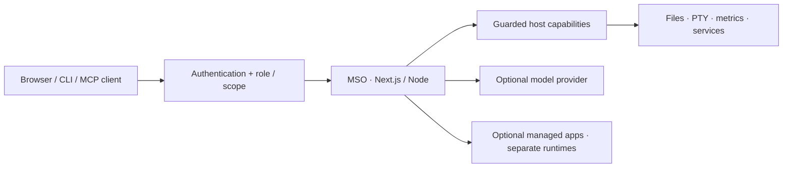

<h1 align="center">Manef Shell OS</h1>
<p align="center"><strong>Your Linux server. One private workspace.</strong></p>
<p align="center">A real terminal, files, system health, and an AI assistant — from your phone or desktop.</p>

<p align="center">
  <a href="#install">Install</a> ·
  <a href="./docs/media/demo.gif">Watch the demo</a> ·
  <a href="./docs/README.md">Documentation</a> ·
  <a href="./SECURITY.md">Security</a>
</p>

<p align="center">
  <a href="https://github.com/rahmanef63/mso/actions/workflows/ci.yml"></a>
  <a href="https://github.com/rahmanef63/mso/actions/workflows/security-core.yml"></a>
  
  
  
</p>


**MSO is a self-hosted visual shell for a Linux server you own.** It runs as a normal,
non-root Node process, without a required database or separate agent service. The browser,
CLI, and optional MCP interface use the same guarded host capabilities.

> **Public Alpha / Developer Preview.** An Owner session or exec-scoped agent can execute
> commands as the service user. Use a dedicated non-root account and a VPN or tightly protected
> HTTPS proxy. MSO is not an operating system, a multi-tenant security boundary, or a certified security product.

## What you can do

| Workspace | What it provides |
|---|---|
| **Operate your server** | Interactive PTY terminal, CPU/memory/disk metrics, service inventory and exact-allowlist lifecycle actions. |
| **Work with files** | Browse, edit, upload, search, preview and organize files inside configured filesystem roots. |
| **Work with AI** | Alfa browser cockpit, terminal agent, durable sessions, trusted skills, explicit mutation approvals and optional MCP access. |
| **Use one responsive shell** | Desktop windows and mobile-first surfaces, media tools, a separate-origin browser and optional managed-app integrations. |

<details>
<summary><strong>Feature details and scoped benchmark evidence</strong></summary>

**Control** — terminal, files, services, package visibility, and system health for the server you own.

- **Open a real terminal** — interactive PTY support for tools like `vim`, `top`, and `ssh`.
- **Manage files** — browse, upload, search, preview, rename, move, copy, zip, and delete within configured filesystem roots.
- **Inspect system health** — view live CPU, memory, disk, network, process, and uptime signals.
- **Operate services safely** — inventory system and user `systemd` units, read bounded journal output, and expose start/stop/restart only for exact owner-configured allowlist entries.
- **See pending package updates** — read the package manager’s existing local cache without refreshing repositories or applying an upgrade.
- **Update itself** — Settings → About shows what is on `origin/main`, lists the incoming commits, and runs the whole deploy (pull → verify the build out-of-tree → build → restart) from a button. The verification runs first on purpose: a commit that does not compile becomes a refusal, not an outage. The updater runs in the owner's systemd user manager and does not require passwordless sudo. Same thing from a shell: `mso update` (`mso update run` remains a compatibility alias). The CLI update path is Git-based and still works when the web runtime is down.
- **Manage other apps on the box** — detect, start/stop/restart, health, version, logs, and state backups for separate applications you already run (Hermes, OpenClaw, 9Router), driven through their own systemd/Docker/CLI contracts. 9Router uses its configured application domain or split-origin host as the in-shell dashboard; its Docker port is loopback-only unless public exposure is explicitly enabled. See [docs/MANAGED-APPS.md](./docs/MANAGED-APPS.md).

**Work** — code/text editor, browser, and media tools in the same workspace.

- **Edit project files** — open text/code files from the file manager without context switching.
- **Preview almost anything** — images (including HEIC/TIFF), audio, video, PDFs, plain text, Markdown, CSV/TSV and HTML, with ← → paging through the folder. Formats no browser can render (Office, iWork, archives, installers) say so and offer the download instead of a blank frame. HTML renders in a fully sandboxed frame, never as a document on MSO's own origin.
- **Keep admin context together** — move between terminal, files, metrics, services, package updates, and browser views.
- **Delegate by device** — approve a browser as Viewer, Operator, or Owner. Roles are rechecked on every request; they are an MSO application boundary, not Linux accounts or enterprise SSO.

**Extend** — Alfa AI, modular slices, and custom apps.

- **Use BYOK AI** — Alfa and the terminal MSO Agent use credentials stored on your server, not committed to the repo. Bare `mso` opens the interactive setup/operations agent. `mso models` manages AI provider/API/OAuth connections; `mso model` only selects the active model from providers that are already connected.
- **Use Alfa Cockpit** — the in-browser assistant now surfaces selected high-value MSO runtime context at the point of execution: active provider/model, searchable project context, trusted host Skills, typed-memory status, native agent sessions, same-principal local-agent presence, pending approvals, and one Activity & Runs timeline. The Cockpit intentionally does **not** claim full CLI parity; credentials/server wiring stay in Settings and dangerous actions still use Alfa's existing approval cards. The same read-model is scriptable as `mso cockpit [project]` / `mso cockpit search <query>`, so the UI does not own a parallel project/session/memory implementation.
- **Run saved Automations for real** — browser-local automation recipes now re-enter Alfa's normal tool loop instead of only narrating their steps. Reads execute through the existing host bindings; write/exec steps keep the same per-call human approval gate. Playbook starter prompts also appear as bounded quick actions in an empty chat.
- **Automate deployment providers without handing tokens to the model** — Dokploy and Cloudflare are built-in feature apps; `mso provider` also supports Hostinger DNS. Secrets stay in owner-only MSO state while bounded provider tools perform live checks and approved deployment/DNS operations. See [docs/INFRASTRUCTURE-PROVIDERS.md](./docs/INFRASTRUCTURE-PROVIDERS.md).
- **Drive the box from ChatGPT, Codex, Claude Code, Cursor, Gemini CLI or VS Code** — MSO exposes one generic OAuth MCP server. ChatGPT gets a source-generated compact static profile with complete title/safety/security metadata, resource-bound OAuth + rotating refresh tokens, while other MCP clients can use the full catalog. Exact current counts and hashes live in [the generated MCP catalog](./docs/generated/MCP-CATALOG.md) so this README does not freeze a stale scanner count. Project-owned MCP tool names never enter the global list: discover/call them dynamically through the generic `project_mcp_tools` / `project_mcp_call` seam. See the [ChatGPT custom MCP guide](./docs/CHATGPT-PLUGIN.md) and [MCP reference](./docs/MCP.md).
- **Message live local sessions by a short name** — every durable same-principal MSO session gets a unique familiar handle such as `@milo`, `@luna`, or `@nara`, independent from its longer auto-generated session title. `/rename <name>` changes that handle, while `/title <text>` changes the session description. `@milo …` resolves only agents with a current lease **and** a live receiver subscription, then creates an explicitly correlated request; replies relay deterministically into the originating conversation while notify-only events remain passive. Presence lease (`idle`/`busy`/`offline`) and receiver subscription (`consumerConnected`) are reported separately so an idle-but-unsubscribed target is diagnosable. For ChatGPT/MCP sessions, `local_agent_inbox(wait_ms=...)` temporarily turns the foreground MCP call into that live receiver for up to 20 seconds, enabling direct two-way session messaging without a worker, DB, webhook, or broker. See [Local Agents](./docs/LOCAL-AGENTS.md).
- **Spawn focused same-session subagents** — `/spawn` and `agent_subagent_run` create bounded foreground workers with isolated context, explicit delegated scope, turn/timeout caps, no recursive spawn, and final-result-only return. They are not Local Agent peers and do not run autonomously after the parent call returns. See [Subagents](./docs/SUBAGENTS.md).
- **Delegate between remote agents with standard A2A v1** — register public HTTPS peers, attach private API-key/Bearer/OAuth access-token profiles, stream remote tasks over SSE, or expose MSO's authenticated inbound Agent Card when a public HTTPS origin is configured. Inbound credentials are owner-minted `read | write | exec` capabilities and run in a memory-isolated task context. See [A2A](./docs/A2A.md).
- **Keep agents efficient independently of the model provider** — the MCP-first [Cognitive Runtime](./docs/COGNITIVE-RUNTIME.md) isolates conversations from OAuth identity, budgets model context/tool output, uses the RASMIC catalog-first router to select a small per-turn capability pack without weakening scopes, compacts durable sessions with sanitized 30-day backup archives, learns only verified workflow recipes, gates repeated procedures through Tool Forge, and batches/filter/aggregates independent reads through `read_pipeline` before raw data reaches the model. Executable Tool Forge candidates require the explicitly provisioned local Forge sandbox and fail closed when that image is absent. `bun run bench:cognitive`, `bun run bench:memory:calibration`, `bun run bench:memory:lifecycle`, `bun run bench:memory:retrieval-calibration`, `bun run bench:pipeline`, isolated scratch-fixture `bun run bench:corpus`, deterministic repeated `bun run bench:corpus:repeat`, and observation-only `bun run bench:cache-calibration` guard routing, memory correction/privacy/retention semantics, frozen-session behavior, retrieval evidence gates, correctness, policy compliance, repeat coverage/spread, latency, context savings, cache telemetry, and proof-gated normalized provider usage.
- **Make orchestration risk-aware and self-improving** — [RASMIC](./docs/RASMIC.md) classifies task risk/contention, retrieves compact repo-local memory, records manual user tests and Evidence Receipts, detects path/shared-resource collisions before merge conflicts, and promotes repeated safe routes from observed traces → recipes → tested bounded scripts.
- **Add app slices** — features are modular under `frontend/slices/<slug>/`.
- **Personalize the interface** — macOS, Windows, iOS, and Android shell layouts are UI preferences, not the core product.

### Cognitive Runtime evidence boundary

The public Cognitive Runtime claim baseline was revalidated on **2026-09-04** against source/main/origin and the deployed build at `1d65a6a`. Current deterministic gates at that SHA report **100% required-tool routing recall**, **96.6% average active-schema reduction**, **8/8 typed-memory fixtures**, **6/6 P9 correction/privacy calibration scenarios at 200 corrections**, and **8/8 P10 lifecycle scenarios**. The P10 retrieval gate is intentionally mixed: lexical retrieval is **4/6**, the existing local semantic candidate is **3/6**, and the bounded two-hop relationship fixture is **3/3**; therefore MSO does **not** claim that vector or graph memory is universally unnecessary.

The strongest currently revalidated MSO↔Hermes comparison is the exact P7+P8 **five-run, nine-scenario, matched `openai-codex/gpt-5.6-terra` corpus**: both agents are **5/5 perfect full runs**. On those exact runs, MSO observed **74.7% fewer normalized tokens/attempt**, **12.8% lower mean average latency**, and **34.1% lower mean per-run p50**. These are corpus-specific observations, **not** a claim that MSO is universally faster, smarter, cheaper, or more reliable. Cost is not ranked; cache-hit frequency is not ranked; OpenClaw is not ranked without an equivalent provider/model path. Older P4/P5 numeric tables remain historical release notes and are not the current public benchmark baseline because this audit could not independently revalidate the exact raw artifacts behind those specific numbers. See [Cognitive Runtime → Evidence status and claim boundaries](./docs/COGNITIVE-RUNTIME.md#evidence-status-and-claim-boundaries) and the versioned [claim-audit evidence manifest](./docs/evidence/cognitive-runtime-claim-audit-2026-09-04.json).

</details>

## Install

Run on your Linux server as your **normal user, not root**. Review the
[bootstrap](./scripts/install.sh) and [installation guide](./docs/INSTALL.md) before executing:

```bash
curl -fsSL https://raw.githubusercontent.com/rahmanef63/mso/main/scripts/install.sh | bash
```

The bootstrap verifies the downloaded installer core before running it. The guided setup
handles credentials through hidden prompts; never paste secrets into chat or command arguments.
The default bind is **127.0.0.1**. Keep the raw application port private.

```bash
mso doctor             # verify the installation
mso web                # open the browser workspace
mso                    # open the terminal agent
mso update             # update an existing installation safely
```

Already installed but missing `mso update`? Re-run the official installer. It preserves
`.env.local` and `~/.mso`, detects the existing service checkout, and refuses dirty/diverged source.
An agent can follow the same repository-owned installation contract; no parallel setup is needed.

<details>
<summary><strong>Full setup: onboarding, WSL, providers, tunnels and installer options</strong></summary>

### Install or update with an AI agent

If your AI agent can open this repository and run commands on your server, your request can be as
short as:

```text
Install or update MSO from this repo: https://github.com/rahmanef63/mso
```

The repository carries the rest of the contract. The agent should use MSO's official installer/update
paths rather than reconstructing setup commands by hand, preserve an existing `.env.local` and
`~/.mso`, update the checkout already owned by `mso.service` instead of creating a second clone, and
finish with `mso doctor`. For a current install it may use `mso update` (the same lifecycle exposed by
Settings → About). If the installed build is old enough that `mso update` or the About updater does not
exist yet, the universal upgrade/recovery path is simply to re-run the current one-line installer below.
Only credentials or choices that cannot be inferred should come back to the user; provider secrets must
stay in hidden/STDIN onboarding prompts rather than command arguments or chat logs.

Run one command on the Linux server as your normal user, **not root**:

```bash
curl -fsSL https://raw.githubusercontent.com/rahmanef63/mso/main/scripts/install.sh | bash
```

That URL is now a **small bootstrap, not the 30 KB installer body**. It downloads
`scripts/install-core.sh` to a private temporary file, retries transient transfers, requires
the complete EOF marker, verifies the committed SHA-256 and `bash -n`, and only then executes
the core. This prevents a truncated `curl | bash` response from stopping after a few preflight
lines while incorrectly returning success. The command stays the same; the execution boundary is safer.

A fresh install now finishes with a **guided terminal onboarding** when a controlling
terminal is available. The public bootstrap itself arrives on stdin, so the verified core
still opens `/dev/tty` for prompts instead of depending on pipeline stdin.
The flow lets you choose:

- **Alfa AI provider** — OpenAI ChatGPT/Codex device OAuth, or an API-key provider such
  as Anthropic, OpenAI Platform, OpenRouter, Google, Groq, xAI, DeepSeek or Mistral;
- **Alfa response preset** — normal, Caveman or Ponytail;
- optional **Hermes / OpenClaw / 9Router** installation (their provider settings remain separate
  from Alfa's credentials);
- optional **Dokploy** plus **Cloudflare or Hostinger** infrastructure connection. Provider secrets
  are entered with hidden prompts and stay server-side;
- reviewed **installable skills** such as Ponytail, Caveman and the MSO-safe RTK wrapper.

Immediately after checkout, the installer installs and validates the CLI **before dependency
installation, the production build, or systemd setup**. It always creates `~/.local/bin/mso`;
when the invoking shell already has `/usr/local/bin` on `PATH`, it also installs a guarded
`/usr/local/bin/mso` launcher (using sudo when needed). That order matters on WSL: even if a
subsequent Bun/Next build fails, `mso -h` remains available for diagnosis and a safe rerun.
The production build invokes Next's installed Node entrypoint directly instead of resolving
`next` through Bun's `.bin` remapper, avoiding Bun 1.3.x's intermittent WSL `bin metadata file`
corruption path.

A child `curl | bash` process cannot modify its parent shell's `PATH`. The installer therefore
checks the **original invoking PATH** after creating the launchers and explicitly reports whether
`mso -h` will work immediately. If neither launcher is already reachable from that PATH, the
install still succeeds, persists `~/.local/bin` in the normal shell profile, and prints the exact
`export PATH=...` command for the current shell instead of falsely claiming success.

If the environment has no controlling TTY (CI/cloud-init), the installer never blocks. It
prints the resume command instead:

```bash
mso onboard
```

For an intentionally non-interactive install, use safe minimal defaults. `-y` does **not**
auto-connect external accounts, install large managed apps, or silently add community
skills:

```bash
curl -fsSL https://raw.githubusercontent.com/rahmanef63/mso/main/scripts/install.sh | bash -s -- -y
```

Already installed? Use the least surprising path:

- **Current MSO:** `mso update`, or Settings → About → Update.
- **Older/legacy MSO where that updater is missing or broken:** re-run the same one-line installer.
  It discovers an existing `mso.service` WorkingDirectory before choosing a default directory, updates
  that checkout in place, preserves `.env.local` + `~/.mso`, and does not repeat onboarding unless
  `--onboard` is requested.
- **Recovery:** re-running the installer is also the supported way to repair installer/runtime wiring;
  it refuses dirty/diverged source instead of resetting user work.

After installation, the installer prints whether the current shell can already resolve `mso`.
On the normal Ubuntu/WSL PATH (which includes `/usr/local/bin`) these work immediately:

```bash
mso                         # interactive MSO setup/operations agent
mso -h
mso models                  # configure AI provider/API/OAuth connections (does not switch model)
mso model                   # arrow-key model picker from connected providers
mso --continue              # resume the latest durable MSO Agent session
mso doctor
mso onboard                 # run/re-run guided setup; starts the built loopback runtime on WSL when needed
mso provider list           # Dokploy/Cloudflare/Hostinger status (secrets masked)
mso web                     # open local UI; starts the built loopback runtime if no service is active
mso update                  # fetch/verify/build safely; does not require :4005 to be alive
mso skills available        # reviewed installable skill list
mso skills install ponytail caveman rtk -y
```

Interactive model/provider menus use a native picker: **↑/↓** moves, typing filters, **Enter**
selects, and **Esc** cancels. No provider/model number has to be memorized. `/session` and bare
`/resume` open one recent-session picker directly: newest modified session first, short `@name`
as the primary label, with the longer human session title and compact `modified …` metadata. Durable session IDs stay hidden in the normal
picker UI but remain accepted by scriptable `--resume`/`/resume` queries. `/new [title]` persists the
current session and switches the same terminal to a fresh durable session. `/restart` is a soft Agent
process replacement: it persists the current session, closes the composer, then reloads the latest CLI
and Agent modules against that exact same durable session id. Repeated restarts keep a constant process
depth. It does **not** restart the MSO service or VPS; updated code plus the latest dynamic
skill/tool/plugin catalog are picked up without abandoning the conversation. Live same-host sessions require no
manual refresh path: `/agents` discovers them automatically, `@milo <prompt>` dispatches a correlated request only when `milo` is active,
`/message <agent> <text>` sends notify-only data, `/delegate <agent> <task>` sends a correlated local task before
remote-A2A fallback, and `/inbox` shows the current session's native agent mailbox. Correlated replies relay as a
durable synthetic assistant response; notify-only events remain passive peer events. `/spawn` is a separate foreground
same-session subagent primitive with isolated context and final-result-only return.
In the Agent slash palette, executable skills carry lifecycle markers so their state is visible before and after use:
`◇ ready` → `◆ queued` (selected for the next message) → `✓ invoked` (actually sent with a model turn).
The interactive transcript is sectioned by full-width `Assistant`, `Agent work`, `Local agent`, and `Error`
dividers. The composer stays in its own bottom `Input · @name` area: the short session handle is the input
identity (`@milo ›`), while permission is shown separately in the bottom footer as `mode ask|auto|yolo`.
Tab on an empty prompt cycles that footer in place without adding scrollback. MSO defaults to `ask`; use
`mso --yolo` or `mso -yolo` when you explicitly want write+exec calls auto-approved for that Agent
process. YOLO still computes and sends the canonical exact-payload approval digest; it only skips the
interactive compact approval prompt. `/permission` opens the same arrow-key style selector; `auto-write`
approves writes but still asks before exec. Permission mode is process-local and is not persisted into a
resumed session. Recoverable HTTP/API failures render a bounded `Error` section instead of silently
ending the interaction. If a write/exec delivery is uncertain, MSO stops that turn and never retries the
mutation automatically; if an earlier mutation completed, the error section says so and instructs the
user/client to continue from that result rather than repeat it. Terminal controls follow familiar agent/shell conventions: **Ctrl+C** clears a non-empty draft, exits from an empty idle prompt, and
interrupts an active model/tool turn; **Ctrl+D** deletes the character to the right or exits on an
empty prompt; **Ctrl+L** clears/repaints; **Ctrl+W** deletes the previous word; **↑/↓** or
**Ctrl+P/N** browse prompt history, including durable user prompts restored by `--continue`/`/resume`. Long drafts wrap dynamically to terminal width/height; **↑/↓** move between visual wrapped rows before falling through to history navigation;
**Ctrl+A/E** and **Ctrl+B/F** move to line boundaries or one character, **Ctrl+U/K** delete to the
start/end of the line, and **Alt+B/F** or **Ctrl+←/→** move by word. `/quit` is an alias for `/exit`.
An interrupted turn is removed from durable conversation
history so `--continue` never resumes a half-turn. Server-side jobs that were already created retain
their own bounded job/cancel lifecycle.

If it explicitly says the current shell cannot see the user launcher yet, run the one-line
`export PATH="$HOME/.local/bin:$PATH"` it prints; new shells use the persisted profile entry.

**WSL2:** the CLI is supported even when systemd is not active. In that case the installer now
finishes the CLI instead of failing in `systemctl`, but it skips `mso.service`. `mso onboard` and
`mso web` can start the already-built production runtime detached on `127.0.0.1` and track ownership
under private state; `mso update` can update/verify/build without a running API and safely inventories, quiesces and restores every gateway-owned fallback runtime for that checkout instead of rebuilding `.next` underneath any of them. For the full
background service, enable systemd in `/etc/wsl.conf`, exit all WSL sessions from Windows, reopen
the distro, then re-run the installer with `--onboard`.

`Caveman`/`Ponytail` appear in two intentionally different places. **Response presets**
(`mso config style caveman|ponytail`) are lightweight Alfa output policies. The market
entries are full `SKILL.md` packages installed into the trusted operator root
`~/.mso/skills`. Selecting a preset does not secretly install a skill, and installing a
skill does not rewrite the global response preset.

The curated `rtk` skill is an MSO-safe wrapper: it teaches agents to use RTK when the
binary is already present, but it does **not** run an unpinned remote installer, modify
shell profiles, or enable global hooks. Installing the RTK binary is a separate explicit
system change.

MSO binds **`127.0.0.1` by default**, so nothing is published directly to your network.
On a laptop/WSL install, the supported public-preview path keeps that invariant and creates an
**outbound HTTPS tunnel** instead of opening port 4005 to the LAN/Internet:

```bash
mso gateway doctor
mso gateway start          # temporary HTTPS URL; installs MSO's pinned cloudflared on first use
mso web                    # opens the active public URL, or loopback when no gateway is running
mso gateway status
mso gateway stop
```

Temporary mode uses a Cloudflare Quick Tunnel and does **not** change `OS_PUBLIC_ORIGIN`, the
MSO bind address, router/NAT rules, or the Windows firewall. The normal password + approved-device
gate, live device roles, Secure/HttpOnly/SameSite cookie, same-origin mutation gate, CSP and login
rate limits remain in front of the host APIs. Gateway state/logs live under an owner-only
checkout+loopback-origin namespace below `~/.mso/private/gateway`, so two clones/ports cannot control
each other's tunnel. `stop` validates process identity before terminating anything. On first use, MSO downloads the reviewed `cloudflared` release pinned in
`security/gateway-artifacts.env` into user-local `~/.mso/tools`, verifies its SHA-256 before first
execution and again before every reuse, and passes `--no-autoupdate`. No root package install,
mutable `latest`, or `curl | sh` is involved. Use `mso gateway install` to prefetch it explicitly.

Quick Tunnels are a **preview/testing** surface, not the permanent deployment path. Cloudflare
documents a 200-concurrent-request limit and no Server-Sent Events support; MSO's live Terminal
uses SSE, so that stream can be unavailable in temporary mode. Files, Settings and ordinary UI/API
requests still use the normal authenticated HTTPS surface. For full-time/full-feature access, use a
named tunnel/custom domain or another production HTTPS reverse proxy.

For a stable domain, keep MSO on loopback and make the public origin explicit:

```bash
mso gateway domain set https://mso.example.com
# create/configure the named Cloudflare Tunnel using the example printed above, then:
mso gateway start --config ~/.cloudflared/config.yml --tunnel mso

mso web
```

If another gateway is already active, stop it first with `mso gateway stop`. MSO refuses to silently ignore explicit named-tunnel arguments or switch tunnel modes underneath an active endpoint.


`mso gateway domain set` updates `OS_PUBLIC_ORIGIN` atomically and prints a loopback-only ingress
example. Named mode accepts only a dedicated two-rule config (`your hostname → MSO loopback`, then
`http_status:404`) and a private owner-owned credentials file. It does not put tunnel tokens on a
command line. A permanent Cloudflare deployment can then add Cloudflare Access/WAF policy in front
of MSO. If you prefer an
SSH-only connection instead, use:

```bash
ssh -N -L 4005:127.0.0.1:4005 you@your-server
```

The local tunnel is not just hygiene. The session cookie is `Secure`; ordinary plain-HTTP public IP
addresses drop it. Bind wider only when the network/firewall design explicitly requires it.

Useful installer controls:

| Control | What it is for |
|---|---|
| `--dir PATH` | Explicit install directory. Normally omit it so an existing service checkout is detected automatically. |
| `--ref REF` | Development/testing ref. Normal installs and self-update use `main`. |
| `--port N` | Local MSO port; default `4005`. |
| `--bind ADDR` | Listen address; default `127.0.0.1`. Do not use `0.0.0.0` unless your firewall/TLS design explicitly requires it. |
| `--no-service` | Build only; do not install the systemd service. |
| `--onboard` | Run guided onboarding even while upgrading an existing install. |
| `--no-onboard` | Install/update without starting onboarding. |
| `-y`, `--yes` | Safe non-interactive defaults; does not connect accounts or install optional apps/skills. |
| `--uninstall` | Remove the systemd unit and MSO CLI links while keeping code and `~/.mso`. |
| `-h`, `--help` | Print the installer contract without changing the host. |

Equivalent public environment overrides are `MSO_DIR`, `MSO_REF`, `MSO_PORT`, `MSO_BIND`, and
`MSO_REPO`. Command-line flags are clearer for people; environment overrides are useful to automation.

```bash
# force onboarding even while updating an existing install
curl -fsSL https://raw.githubusercontent.com/rahmanef63/mso/main/scripts/install.sh | bash -s -- --onboard

# update/build without onboarding
curl -fsSL https://raw.githubusercontent.com/rahmanef63/mso/main/scripts/install.sh | bash -s -- --no-onboard

# explicit non-default location/port (only when you intentionally need them)
curl -fsSL https://raw.githubusercontent.com/rahmanef63/mso/main/scripts/install.sh | bash -s -- --dir "$HOME/mso" --port 4005
```

There is also a no-login install guide at **<https://mso.rahmanef.com/install>**. **Browser
sign-in requires HTTPS**, except when you access MSO through a loopback URL such as
`http://localhost:4005`. Do not pair/approve a browser on plain `http://<server-ip>:4005`:
the session cookie is `Secure`, so the browser cannot keep the login there. Full production setup,
TLS/VPN notes, filesystem roots, update/rollback and onboarding details live in
[docs/INSTALL.md](./docs/INSTALL.md).

</details>

## How it works



Core persistence is local. Optional model-provider calls send the selected context off-host;
**BYOK does not mean the data stays on your server**. Files and model output are untrusted input,
not permission to execute a command. See [architecture](./docs/ARCHITECTURE.md) and
[the AI/tool contract](./frontend/slices/assistant/CONTRACT.md).

## CLI

```bash
mso -h                 # discover commands
mso stats              # inspect system health
mso ls ~/projects      # browse a configured filesystem root
mso model              # select a connected model
mso --continue         # resume the latest durable agent session
```

<details>
<summary><strong>More CLI examples and integration notes</strong></summary>

The browser UI is one frontend, not the product. The installer puts `mso` on your
`PATH`, and it reaches the same API — every endpoint has a named verb, and `mso api`
covers anything without one.

```bash
mso                          # interactive setup/operations agent with MSO ASCII terminal UI
mso -h                       # grouped command list; `mso <command> --help` per command
mso models                   # configure AI provider/API/OAuth connections
mso model                    # arrow-key model picker / switch active model
mso --continue               # resume the latest MSO Agent session
mso --resume "@milo"         # resume by @name; index/id/title queries remain supported
mso doctor                   # includes HTTPS/login-origin diagnosis
mso doctor --fix             # safe local repairs; never changes DNS/TLS/firewall/credentials
mso onboard                  # guided AI/app/infrastructure/skill setup
mso provider list            # masked Dokploy/Cloudflare/Hostinger state
mso provider set cloudflare  # hidden credential prompts + live verification
mso skills available         # curated installable skills
mso skills install ponytail caveman rtk -y
mso device pending           # who typed the password and is waiting
mso device approve <id> "my phone" --role viewer
mso ls ~/projects            # files; `raw` for binaries, `zip`/`upload` for transfers
mso exec "df -h"             # host shell
mso stats                    # cpu / mem / disk
mso units                    # system + user systemd inventory
mso unit logs user mso.service
mso packages                 # cached updates; never applies them
mso camoufox start           # power the anti-detection browser
mso mapp logs hermes         # managed apps (hermes, openclaw, 9router)
mso term open                # interactive PTY
mso service restart          # systemd
mso api GET /api/v1/sys/stats   # escape hatch — any endpoint
eval "$(mso completion bash)"   # tab completion
```

Full command reference: [docs/CLI.md](./docs/CLI.md) (generated from `mso --help`).

Global options: `--base <url>` to target another instance, `--env <file>` to pick a
different secrets file. Device and service commands work even while the service is
down. If you use [Claude Code](https://claude.com/claude-code), the installer also
links every committed official skill in `claude-skills/` into `~/.claude/skills/`. Create a consistent workflow skill with `bun run skill:new -- --help` and validate the catalog with `bun run skill:check`.

</details>

## Security warning

**The terminal and exec-scoped tools are not sandboxes.** Device roles narrow API access,
but every role shares one deployment and the same underlying Unix service account.
MCP is disabled unless explicitly enabled. Approve only trusted devices and tokens; keep
filesystem write roots narrow and read the exact command on every approval card.

Security checks are evidence at a particular revision, not a guarantee. The project has
**not had an independent third-party security audit**. Read the [security policy](./SECURITY.md)
and [repeatable assurance process](./docs/SECURITY-ASSURANCE.md) before exposing an instance.

<details>
<summary><strong>Full trust boundaries, provider data handling and operational controls</strong></summary>

An authenticated **Owner** session can read allowed files and run commands as the Unix user that owns the process. Viewer and Operator devices are server-gated to narrower surfaces, but all roles still share one MSO deployment and one underlying Unix account.

- Run as a dedicated non-root user.
- Prefer Tailscale or a VPN; otherwise use HTTPS plus a strict firewall or allowlist.
- Use a strong `OS_SESSION_SECRET` and a strong `OS_LOGIN_PASSWORD`.
- Approve only trusted devices; use Viewer by default, Operator only for bounded operational work, and Owner only where full host authority is intended. Device approval is an allowlist, not standards-based MFA or a named-user directory.
- Keep write roots narrow with `OS_FS_WRITE_ROOTS`.
- Service inventory is read-only by default. Lifecycle buttons require Operator/Owner **and** an exact `OS_SERVICE_CONTROL_UNITS` entry; wildcards are rejected. Package visibility reads only the existing local cache and never upgrades the host.
- Never commit `.env.local`, API keys, or data from `~/.mso`. Infrastructure provider tokens live in `~/.mso/private/infra-providers.json` with owner-only permissions; the agent receives only credential-free tool schemas and masked provider state.
- Dokploy/Cloudflare/Hostinger automation is intentionally bounded. Cloudflare changes one exact record and never bulk-writes a zone; proxying defaults off. Hostinger updates one exact name/type RR-set with `overwrite:true`; unrelated zone rows are never sent in the mutation payload, while ambiguity/conflicts are still refused and writes require approval.
- Managed-app dashboards are not embedded by default. 9Router is loopback-only by default; a direct public-IP bind requires `NINE_ROUTER_EXPOSE_PUBLIC=1`, while a configured application hostname remains its preferred in-shell UI. Give each vendor UI a separate explicit hostname such as `hermes.mso.example.com`; there is no supported same-origin iframe mode.
- Camoufox/noVNC is also never served on the cockpit origin. It uses the reserved split-origin host such as `camoufox.mso.example.com`; the legacy `/camoufox-vnc/*` path is permanently closed.
- That boundary is browser-only: a plugin installed into Hermes or OpenClaw runs inside that daemon and can run host commands according to the daemon's own trust model.
- With a model provider configured, Alfa is a tool-calling agent, not a plain chatbot. Its complete current catalog and human-approval contract are generated from `frontend/slices/assistant/host-tools/*` and documented in `frontend/slices/assistant/CONTRACT.md`; avoid copying a tool count into overview docs because the catalog changes independently of MCP.
- Everything Alfa reads — file contents, command output, process lists — is sent to your model provider, and is re-sent on every following turn of the same run. BYOK means you own the key, not that the data stays on the box.
- Choosing an Alfa Cockpit project adds a **bounded metadata snapshot** to each turn (project/path, branch/tree state, HEAD, knowledge availability, and recent project-memory topic titles). It does not inject raw project knowledge or raw repo-memory bodies. Cockpit also masks non-`normal` typed-memory keys/values as `Private memory`; selecting a project is context, never mutation permission.
- Treat any file Alfa reads as untrusted input. The approval card is the only thing between text hidden inside a file and an `exec.run`. Read the command on the card, not Alfa's summary of it.
- Agents and Skills group tools for your own convenience. They are not a permission boundary: every agent can call every tool.
- `exec.run` is not sandboxed. Its cwd is bounded to your write roots, but the command itself runs in your login shell as the service user. The destructive-command denylist is a short accident tripwire, not a guard.
- The MCP server is off unless `OS_MCP_ENABLED=1`. When on, a bearer token is a standing credential with whatever scope you granted it: at `exec` it runs any command on the box as you, and every call and result goes to the client's provider. The consent screen preselects the server ceiling (`exec` by default), so lower it before Allow when a client needs less; cap all tokens with `OS_MCP_MAX_SCOPE`, and treat anything the model reads as untrusted — scope is what stops a prompt-injected file talking it into a write. See [docs/MCP.md](./docs/MCP.md).
- MSO has not had a third-party security audit.

More detail: [SECURITY.md](./SECURITY.md), [docs/FAQ.md](./docs/FAQ.md) and [docs/INSTALL.md](./docs/INSTALL.md).

</details>

## Development

The reference runtime is **Node 22** (`.nvmrc`); use **Bun** for dependency installation and
`bun.lock` for reproducibility. Run local development only on a trusted machine.

```bash
bun install --frozen-lockfile
cp .env.example .env.local  # configure local credentials; never commit this file
bun run dev
```

```bash
bun run verify             # typecheck, lint, coverage, architecture/docs, local audit
bun run test:features       # separate test process for each area; reports coverage gaps
bun run audit:strict        # unavailable/malformed dependency evidence fails closed
bash scripts/verify-build.sh  # compile committed HEAD out-of-tree, not over a live build
```

`bun run test` uses Vitest. **Do not substitute `bun test`**, which uses a different runner.
The ordinary local audit can explicitly skip an unavailable registry; it is not security proof.
Use the strict audit and the [security lanes](./docs/SECURITY-ASSURANCE.md) for release assurance.

**Version contracts are independent:** `package.json` owns the app version, `bin/mso`
owns CLI compatibility, and `lib/mcp/toolset.ts` owns MCP server/toolset compatibility.
`mso --version` labels app, CLI and Git build; the updater uses the exact Git build as release authority.
A documentation/security-maintenance change does not invent a new MCP tool contract.

## Comparison

<details>
<summary><strong>Product scope comparison — methodology and limitations included</strong></summary>

<!-- comparison:start -->
**Positioning:** MSO is designed as a mobile-first, AI-native private Linux workspace for an owner or small trusted team. It does not claim to replace specialist products at their strongest specialty.

Strong = a first-class product strength · Partial = available with scope limitations · Not offered = not a core product surface

| Product | Best fit | Browser workspace | Linux host administration | Application delivery | Monitoring and observability | Roles and delegation | Built-in AI and MCP |
|---|---|:---:|:---:|:---:|:---:|:---:|:---:|
| **MSO** | Mobile-first private Linux workspace | Strong | Partial | Partial | Partial | Partial | Strong |
| **Cockpit** | Deep graphical Linux administration | Partial | Strong | Partial | Partial | Strong | Not offered |
| **Coolify** | Self-hosted Git/PaaS delivery | Partial | Partial | Strong | Partial | Strong | Not offered |
| **Portainer** | Container and stack operations | Partial | Partial | Strong | Partial | Partial | Not offered |
| **Netdata** | High-resolution observability and RCA | Partial | Not offered | Not offered | Strong | Partial | Partial |
| **Tailscale SSH** | Identity-aware private remote access | Not offered | Partial | Not offered | Not offered | Strong | Not offered |
| **File Browser** | Focused web file management | Partial | Not offered | Not offered | Not offered | Partial | Not offered |
| **ttyd** | Small, focused web terminal | Partial | Not offered | Not offered | Not offered | Partial | Not offered |
| **CasaOS** | Friendly personal-cloud home server | Partial | Partial | Partial | Partial | Not offered | Not offered |
| **Runtipi** | Curated one-click self-hosted apps | Partial | Not offered | Strong | Partial | Not offered | Not offered |

Reviewed against official product documentation on **2026-08-29**. Ratings describe product scope, not benchmark scores. See [methodology, evidence, and per-cell notes](docs/COMPARISON.md) and the [execution roadmap](docs/COMPETITIVE-ROADMAP.md).
<!-- comparison:end -->

</details>

## Tested platforms

<details>
<summary><strong>Linux / WSL deployment support and untested platforms</strong></summary>

Not yet formally tested across a full distro matrix.

Tested:

- Ubuntu 22.04
- Ubuntu 24.04

Supported deployment shapes:

- WSL2 Ubuntu: CLI/install path works without systemd; the background service requires systemd enabled in WSL
- Debian 12 and other systemd-based Linux distributions with Node.js 20.9+ and build tools

Not currently supported:

- Windows host
- macOS host
- Automatic service install on non-systemd hosts
- Root deployment

</details>

## Documentation

| Start here | Reference |
|---|---|
| Install, update, recover | [Installation](./docs/INSTALL.md) · [Troubleshooting](./docs/TROUBLESHOOTING.md) |
| Use the CLI or connect MCP | [Generated CLI reference](./docs/CLI.md) · [MCP](./docs/MCP.md) · [ChatGPT integration](./docs/CHATGPT-PLUGIN.md) |
| Understand the runtime | [Architecture](./docs/ARCHITECTURE.md) · [Cognitive Runtime](./docs/COGNITIVE-RUNTIME.md) |
| Contribute or review security | [Contributing](./CONTRIBUTING.md) · [Development](./docs/DEVELOPMENT.md) · [Security](./SECURITY.md) |
| Browse everything | [Documentation map](./docs/README.md) · [Changelog](./docs/CHANGELOG.md) |

The [maintainer's instance](https://mso.rahmanef.com) requires authentication; it is **not a public demo**.
The [recorded demo](./docs/media/demo.gif) is available without access to a real server.
A separate mock-only demo must keep `NEXT_PUBLIC_OS_DEMO=1` at build time and bind to loopback
unless its owner explicitly publishes it; never enable demo mode on an owner deployment.

## Status and license

**Public Alpha / Developer Preview** — expect rough edges and breaking changes.
MIT licensed; see [LICENSE](./LICENSE).
