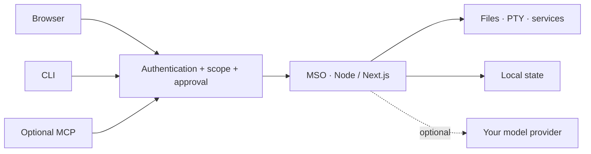
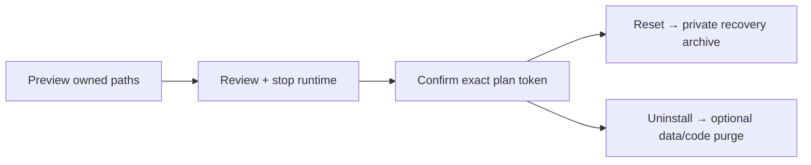

<h1 align="center">Manef Shell OS</h1>
<p align="center"><strong>Your server. A workspace, not another dashboard.</strong></p>
<p align="center">Terminal · files · AI · system health — from a browser or CLI.</p>
<p align="center"><a href="./docs/INSTALL.md">Install</a> · <a href="./docs/CLI.md">CLI</a> · <a href="./docs/README.md">Docs</a> · <a href="./SECURITY.md">Security</a></p>


## One workspace

| Operate | Create | Automate |
|---|---|---|
| PTY terminal · files · system health | Code · image/video tools · browser | Alfa assistant · trusted skills · optional MCP |
| Exact-allowlist service controls | Desktop windows · mobile layouts | Approvals · durable sessions · local memory |

## In your terminal


```bash
mso                 # terminal agent
mso doctor          # installation checks
mso web             # browser workspace
mso update          # guarded update from main
```

[Command reference](./docs/CLI.md) · [Recorded browser demo](./docs/media/demo.gif)

## How it fits together



One self-hosted application. No required database or separate agent service.
[Architecture](./docs/ARCHITECTURE.md) · [Detailed workspace guide](./docs/reference/WORKSPACE-GUIDE.md)

## Install or update MSO from this repo

Run as your **normal Linux user, not root**. Review [scripts/install.sh](./scripts/install.sh) before executing:

```bash
curl -fsSL https://raw.githubusercontent.com/rahmanef63/mso/main/scripts/install.sh | bash
```

Default application bind: **127.0.0.1**. Use a VPN or protected HTTPS proxy for remote access.
[Full installation, WSL and recovery guide](./docs/INSTALL.md)

## Reset or remove



| Preview command — no changes yet | Scope |
|---|---|
| `mso reset` | Server preferences and provider configuration |
| `mso reset --scope all` | Factory reset of known MSO state and local configuration |
| `mso uninstall` | Remove owned service/CLI links; keep data and source |
| `mso uninstall --purge --remove-code` | Also remove known data and a clean standalone clone |

Apply requires `--apply --confirm <preview-token>` from an independent local/SSH terminal.
Browser reset is separate in **Settings → About**. Unknown files and other projects are retained.
[Scopes, backups, safeguards and recovery](./docs/MAINTENANCE.md)

## Safety first

**Public Alpha / Developer Preview.** An Owner or exec-scoped agent can execute commands as the
service user. MSO is **not a shell sandbox or multi-tenant security boundary**. Provider calls may
send selected context off-host. Keep credentials private and review approvals.
[Security policy](./SECURITY.md) · [Verification and known limits](./docs/SECURITY-ASSURANCE.md)

<!-- comparison:start -->
[Product comparison, evidence and limitations](docs/COMPARISON.md) · reviewed 2026-08-29.
<!-- comparison:end -->

## Develop

```bash
bun install --frozen-lockfile
bun run verify
bun run test:features
bun run audit:strict
```

Use Node 22 and Bun >=1.2.15 with native audit support. [Contributing](./CONTRIBUTING.md) ·
[Development](./docs/DEVELOPMENT.md) · [Changelog](./docs/CHANGELOG.md) · [MIT license](./LICENSE)
