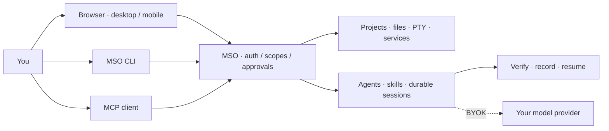

<h1 align="center">Manef Shell OS</h1>
<p align="center"><strong>A workspace for your server. A runtime for your agents.</strong></p>
<p align="center">Real terminals, project-aware AI, files and services — in one self-hosted workspace.</p>
<p align="center"><a href="#see-it-work">Demo</a> · <a href="#install-or-update-mso-from-this-repo">Install</a> · <a href="./docs/COGNITIVE-RUNTIME.md">Agent runtime</a> · <a href="./docs/README.md">Docs</a></p>
<p align="center"><a href="https://github.com/rahmanef63/mso/actions/workflows/ci.yml"></a> <a href="https://github.com/rahmanef63/mso/actions/workflows/security-alerts.yml"></a></p>

## See it work

[](./docs/media/demo.gif)

*A recorded browser walkthrough, not a mockup. The GIF plays here; click to open it at full size.*

| Your server, visually | Your tools, in the terminal |
|---|---|
|  |  |

## More than an AI chat window

| Ask it to… | What MSO brings |
|---|---|
| **Understand a project** | Project context, trusted skills and task-specific tool discovery. |
| **Do the work** | Real PTY, bounded file tools, service controls and explicit approvals. |
| **Pick up where you left off** | Durable sessions, local memory, workflow evidence and agent handoffs. |

**One runtime, three ways in:** use desktop/mobile windows, stay in your terminal, or connect an MCP client.
Code, image/video tools, a browser and native credential setup live beside your operational tools.



[Private session screenshots](./docs/SESSION-ARTIFACTS.md) · [How the agent runtime works](./docs/COGNITIVE-RUNTIME.md) · [Architecture](./docs/ARCHITECTURE.md) · [Native Integrations](./docs/INTEGRATIONS.md)

## Install or update MSO from this repo

**Linux · normal non-root user · Node 22.** One application; no required database or separate agent service.
Review [scripts/install.sh](./scripts/install.sh), then:

```bash
curl -fsSL https://raw.githubusercontent.com/rahmanef63/mso/main/scripts/install.sh | bash
```

```bash
mso doctor       # check the installation
mso              # work with the terminal agent
mso web          # open the browser workspace
mso --continue   # resume your last session
```

The application binds to **127.0.0.1** by default. Use a VPN or protected HTTPS proxy for remote access.
[Full installation and WSL guide](./docs/INSTALL.md) · [CLI reference](./docs/CLI.md)

<details>
<summary><strong>Update, reset or uninstall — preview before changing anything</strong></summary>

`mso update` updates from main. `mso reset` and `mso reset --scope all` preview configuration/factory resets;
`mso uninstall --purge --remove-code` previews removal of owned data and a clean standalone clone.
Applying reset/uninstall requires an offline runtime and an exact confirmation token from an independent terminal.
Browser reset is separate in **Settings → About**. [Backups, scope and safeguards](./docs/MAINTENANCE.md).

</details>

## Build with it

```bash
bun install --frozen-lockfile
bun run verify
bun run test:features
bun run audit:strict
```

Use Bun >=1.2.15 with native audit support. [Contributing](./CONTRIBUTING.md) · [Development](./docs/DEVELOPMENT.md) · [Changelog](./docs/CHANGELOG.md)

## Powerful by design. Not a sandbox.

**Public Alpha / Developer Preview.** Owner/exec authority can run commands as the service user.
Provider calls may send selected context off-host. Review approvals and keep credentials private.
Successful analysis jobs are not proof of zero open alerts; the security badge above checks the actual inventory.
[Security policy](./SECURITY.md) · [Verification and known limits](./docs/SECURITY-ASSURANCE.md)

<!-- comparison:start -->
[Product comparison, evidence and limitations](docs/COMPARISON.md) · reviewed 2026-08-29.
<!-- comparison:end -->

[MIT license](./LICENSE) · [Detailed workspace guide](./docs/reference/WORKSPACE-GUIDE.md)
