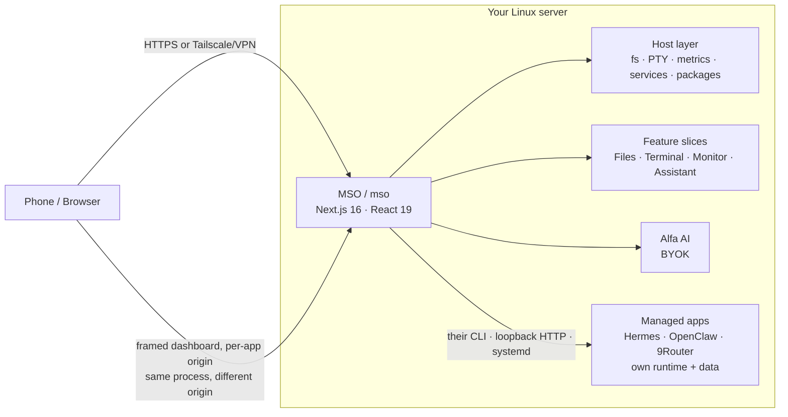

<h1 align="center">Manef Shell OS</h1>

<p align="center"><strong>Your Linux server, finally usable from your phone.</strong></p>

<p align="center">
  Open a real terminal, manage files, inspect system health, and use AI from one private browser workspace.
</p>

<p align="center">
  <a href="https://mso.rahmanef.com"><strong>Live instance</strong></a>
  ·
  <a href="./docs/media/demo.gif"><strong>Watch Demo</strong></a>
  ·
  <a href="#install"><strong>Install</strong></a>
</p>

<p align="center">
  <a href="https://github.com/rahmanef63/mso/actions/workflows/ci.yml"></a>
  <a href="https://github.com/rahmanef63/mso/actions/workflows/codeql.yml"></a>
  <a href="https://github.com/rahmanef63/mso/actions/workflows/security-core.yml"></a>
  <a href="https://scorecard.dev/viewer/?uri=github.com/rahmanef63/mso"></a>
  
  
  
  
  
</p>

<p align="center">
  
  
  
  
  
</p>

**Manef Shell OS** (**MSO** in the UI) is an open-source, mobile-friendly visual shell for a Linux server you own. It brings a real terminal, file manager, live system metrics, service/package visibility, device-scoped roles, and a BYOK AI assistant into one private browser workspace without running a full remote desktop.

MSO is **Public Alpha / Developer Preview** software. It runs on top of Linux as a normal non-root Node process. It is not an operating system, Linux distribution, desktop environment, VPS provider, or production-grade security platform.

For a real deployment, put MSO behind **Tailscale, a VPN, or a TLS reverse proxy with tight access control**. Do not expose the raw app port to the public internet.

**Security assurance:** MSO publishes its [security policy](./SECURITY.md) and [repeatable assurance process](./docs/SECURITY-ASSURANCE.md), with CodeQL, independent SAST/dependency/secret scanners, OpenSSF Scorecard, SBOM generation, passive OWASP ZAP checks, and MSO-specific security regression tests. The evidence is intentionally presented as testing—not as a security certification.

## Product screenshot/video


<p align="center">
  
</p>

## What you can do

**Control** — terminal, files, services, package visibility, and system health for the server you own.

- **Open a real terminal** — interactive PTY support for tools like `vim`, `top`, and `ssh`.
- **Manage files** — browse, upload, search, preview, rename, move, copy, zip, and delete within configured filesystem roots.
- **Inspect system health** — view live CPU, memory, disk, network, process, and uptime signals.
- **Operate services safely** — inventory system and user `systemd` units, read bounded journal output, and expose start/stop/restart only for exact owner-configured allowlist entries.
- **See pending package updates** — read the package manager’s existing local cache without refreshing repositories or applying an upgrade.
- **Update itself** — Settings → About shows what is on `origin/main`, lists the incoming commits, and runs the whole deploy (pull → verify the build out-of-tree → build → restart) from a button. The verification runs first on purpose: a commit that does not compile becomes a refusal, not an outage. The updater runs in the owner's systemd user manager and does not require passwordless sudo. Same thing from a shell: `mso update` (`mso update run` remains a compatibility alias). The CLI update path is Git-based and still works when the web runtime is down.
- **Manage other apps on the box** — detect, start/stop/restart, health, version, logs, and state backups for separate applications you already run (Hermes, OpenClaw, 9Router), driven through their own systemd/Docker/CLI contracts. 9Router uses its configured application domain or split-origin host as the in-shell dashboard; its Docker port is loopback-only unless public exposure is explicitly enabled. See [docs/MANAGED-APPS.md](./docs/MANAGED-APPS.md).

**Work** — code/text editor, browser, and media tools in the same workspace.

- **Edit project files** — open text/code files from the file manager without context switching.
- **Preview almost anything** — images (including HEIC/TIFF), audio, video, PDFs, plain text, Markdown, CSV/TSV and HTML, with ← → paging through the folder. Formats no browser can render (Office, iWork, archives, installers) say so and offer the download instead of a blank frame. HTML renders in a fully sandboxed frame, never as a document on MSO's own origin.
- **Keep admin context together** — move between terminal, files, metrics, services, package updates, and browser views.
- **Delegate by device** — approve a browser as Viewer, Operator, or Owner. Roles are rechecked on every request; they are an MSO application boundary, not Linux accounts or enterprise SSO.

**Extend** — Alfa AI, modular slices, and custom apps.

- **Use BYOK AI** — Alfa uses credentials stored on your server, not committed to the repo.
- **Drive the box from ChatGPT, Claude.ai or Cursor** — an optional MCP server (OAuth 2.1 + PKCE) exposes files, system health, global project/skill discovery, ChatGPT file import and, at `exec`, a shell. The read/write/exec ladder is the server-side permission boundary. See the [ChatGPT custom MCP app guide](./docs/CHATGPT-PLUGIN.md) for setup/diagrams and [MCP reference](./docs/MCP.md) for internals.
- **Add app slices** — features are modular under `frontend/slices/<slug>/`.
- **Personalize the interface** — macOS, Windows, iOS, and Android shell layouts are UI preferences, not the core product.

## What can you do with MSO?

**Fix a server issue from your phone**  
Check system health, inspect a failed unit and its logs, restart an exact allowlisted service, or open the owner terminal without opening a laptop.

**Manage project files visually**  
Browse, upload, rename, preview, and edit files without remembering every shell command.

**Work with your server in one workspace**  
Move between terminal, files, metrics, services, package updates, browser, and AI without switching between several admin tools.

## Live demo

The public demo should be deployed from a separate checkout with:

```bash
NEXT_PUBLIC_OS_DEMO=1 bun run build && bun run start
```

Demo mode skips real login, forces mock data, blocks live host API access, and shows a permanent demo banner. Use it for Product Hunt traffic. A real owner deployment should stay behind Tailscale/VPN or a protected HTTPS proxy.

- Live instance (the maintainer's own cockpit, auth-gated — not a demo): <https://mso.rahmanef.com>
- Watch demo: [docs/media/demo.gif](./docs/media/demo.gif)

## Install

Run one command on the Linux server as your normal user, **not root**:

```bash
curl -fsSL https://raw.githubusercontent.com/rahmanef63/mso/main/scripts/install.sh | bash
```

That URL is now a **small bootstrap, not the 30 KB installer body**. It downloads
`scripts/install-core.sh` to a private temporary file, retries transient transfers, requires
the complete EOF marker, verifies the committed SHA-256 and `bash -n`, and only then executes
the core. This prevents a truncated `curl | bash` response from stopping after a few preflight
lines while incorrectly returning success. The command stays the same; the execution boundary is safer.

A fresh install now finishes with a **guided terminal onboarding** when a controlling
terminal is available. The public bootstrap itself arrives on stdin, so the verified core
still opens `/dev/tty` for prompts instead of depending on pipeline stdin.
The flow lets you choose:

- **Alfa AI provider** — OpenAI ChatGPT/Codex device OAuth, or an API-key provider such
  as Anthropic, OpenAI Platform, OpenRouter, Google, Groq, xAI, DeepSeek or Mistral;
- **Alfa response preset** — normal, Caveman or Ponytail;
- optional **Hermes / OpenClaw / 9Router** installation (their provider settings remain separate
  from Alfa's credentials);
- reviewed **installable skills** such as Ponytail, Caveman and the MSO-safe RTK wrapper.

Immediately after checkout, the installer installs and validates the CLI **before dependency
installation, the production build, or systemd setup**. It always creates `~/.local/bin/mso`;
when the invoking shell already has `/usr/local/bin` on `PATH`, it also installs a guarded
`/usr/local/bin/mso` launcher (using sudo when needed). That order matters on WSL: even if a
subsequent Bun/Next build fails, `mso -h` remains available for diagnosis and a safe rerun.
The production build invokes Next's installed Node entrypoint directly instead of resolving
`next` through Bun's `.bin` remapper, avoiding Bun 1.3.x's intermittent WSL `bin metadata file`
corruption path.

A child `curl | bash` process cannot modify its parent shell's `PATH`. The installer therefore
checks the **original invoking PATH** after creating the launchers and explicitly reports whether
`mso -h` will work immediately. If neither launcher is already reachable from that PATH, the
install still succeeds, persists `~/.local/bin` in the normal shell profile, and prints the exact
`export PATH=...` command for the current shell instead of falsely claiming success.

If the environment has no controlling TTY (CI/cloud-init), the installer never blocks. It
prints the resume command instead:

```bash
mso onboard
```

For an intentionally non-interactive install, use safe minimal defaults. `-y` does **not**
auto-connect external accounts, install large managed apps, or silently add community
skills:

```bash
curl -fsSL https://raw.githubusercontent.com/rahmanef63/mso/main/scripts/install.sh | bash -s -- -y
```

After installation, the installer prints whether the current shell can already resolve `mso`.
On the normal Ubuntu/WSL PATH (which includes `/usr/local/bin`) these work immediately:

```bash
mso -h
mso doctor
mso onboard                 # run/re-run guided setup; starts the built loopback runtime on WSL when needed
mso web                     # open local UI; starts the built loopback runtime if no service is active
mso update                  # fetch/verify/build safely; does not require :4005 to be alive
mso skills available        # reviewed installable skill list
mso skills install ponytail caveman rtk -y
```

If it explicitly says the current shell cannot see the user launcher yet, run the one-line
`export PATH="$HOME/.local/bin:$PATH"` it prints; new shells use the persisted profile entry.

**WSL2:** the CLI is supported even when systemd is not active. In that case the installer now
finishes the CLI instead of failing in `systemctl`, but it skips `mso.service`. `mso onboard` and
`mso web` can start the already-built production runtime detached on `127.0.0.1` and track ownership
under private state; `mso update` can update/verify/build without a running API and safely quiesces/restores a gateway-owned fallback runtime instead of rebuilding `.next` underneath it. For the full
background service, enable systemd in `/etc/wsl.conf`, exit all WSL sessions from Windows, reopen
the distro, then re-run the installer with `--onboard`.

`Caveman`/`Ponytail` appear in two intentionally different places. **Response presets**
(`mso config style caveman|ponytail`) are lightweight Alfa output policies. The market
entries are full `SKILL.md` packages installed into the trusted operator root
`~/.mso/skills`. Selecting a preset does not secretly install a skill, and installing a
skill does not rewrite the global response preset.

The curated `rtk` skill is an MSO-safe wrapper: it teaches agents to use RTK when the
binary is already present, but it does **not** run an unpinned remote installer, modify
shell profiles, or enable global hooks. Installing the RTK binary is a separate explicit
system change.

MSO binds **`127.0.0.1` by default**, so nothing is published directly to your network.
On a laptop/WSL install, the supported public-preview path keeps that invariant and creates an
**outbound HTTPS tunnel** instead of opening port 4005 to the LAN/Internet:

```bash
mso gateway doctor
mso gateway start          # temporary HTTPS URL; installs MSO's pinned cloudflared on first use
mso web                    # opens the active public URL, or loopback when no gateway is running
mso gateway status
mso gateway stop
```

Temporary mode uses a Cloudflare Quick Tunnel and does **not** change `OS_PUBLIC_ORIGIN`, the
MSO bind address, router/NAT rules, or the Windows firewall. The normal password + approved-device
gate, live device roles, Secure/HttpOnly/SameSite cookie, same-origin mutation gate, CSP and login
rate limits remain in front of the host APIs. Gateway state/logs live under an owner-only
checkout+loopback-origin namespace below `~/.mso/private/gateway`, so two clones/ports cannot control
each other's tunnel. `stop` validates process identity before terminating anything. On first use, MSO downloads the reviewed `cloudflared` release pinned in
`security/gateway-artifacts.env` into user-local `~/.mso/tools`, verifies its SHA-256 before first
execution and again before every reuse, and passes `--no-autoupdate`. No root package install,
mutable `latest`, or `curl | sh` is involved. Use `mso gateway install` to prefetch it explicitly.

Quick Tunnels are a **preview/testing** surface, not the permanent deployment path. Cloudflare
documents a 200-concurrent-request limit and no Server-Sent Events support; MSO's live Terminal
uses SSE, so that stream can be unavailable in temporary mode. Files, Settings and ordinary UI/API
requests still use the normal authenticated HTTPS surface. For full-time/full-feature access, use a
named tunnel/custom domain or another production HTTPS reverse proxy.

For a stable domain, keep MSO on loopback and make the public origin explicit:

```bash
mso gateway domain set https://mso.example.com
# create/configure the named Cloudflare Tunnel using the example printed above, then:
mso gateway start --config ~/.cloudflared/config.yml --tunnel mso
mso web
```

`mso gateway domain set` updates `OS_PUBLIC_ORIGIN` atomically and prints a loopback-only ingress
example. Named mode accepts only a dedicated two-rule config (`your hostname → MSO loopback`, then
`http_status:404`) and a private owner-owned credentials file. It does not put tunnel tokens on a
command line. A permanent Cloudflare deployment can then add Cloudflare Access/WAF policy in front
of MSO. If you prefer an
SSH-only connection instead, use:

```bash
ssh -N -L 4005:127.0.0.1:4005 you@your-server
```

The local tunnel is not just hygiene. The session cookie is `Secure`; ordinary plain-HTTP public IP
addresses drop it. Bind wider only when the network/firewall design explicitly requires it.

Useful installer controls:

```bash
# force onboarding even while updating an existing install
curl -fsSL https://raw.githubusercontent.com/rahmanef63/mso/main/scripts/install.sh | bash -s -- --onboard

# update/build without onboarding
curl -fsSL https://raw.githubusercontent.com/rahmanef63/mso/main/scripts/install.sh | bash -s -- --no-onboard

# other existing controls
curl -fsSL https://raw.githubusercontent.com/rahmanef63/mso/main/scripts/install.sh | bash -s -- --port 4005
curl -fsSL https://raw.githubusercontent.com/rahmanef63/mso/main/scripts/install.sh | bash -s -- --bind 0.0.0.0
curl -fsSL https://raw.githubusercontent.com/rahmanef63/mso/main/scripts/install.sh | bash -s -- --no-service
curl -fsSL https://raw.githubusercontent.com/rahmanef63/mso/main/scripts/install.sh | bash -s -- --uninstall
```

There is also a no-login install guide at **<https://mso.rahmanef.com/install>**. Full
production setup, TLS/VPN notes, filesystem roots, update/rollback and onboarding details
live in [docs/INSTALL.md](./docs/INSTALL.md).

## CLI

The browser UI is one frontend, not the product. The installer puts `mso` on your
`PATH`, and it reaches the same API — every endpoint has a named verb, and `mso api`
covers anything without one.

```bash
mso -h                       # grouped command list; `mso <command> --help` per command
mso doctor                   # deps, env, service, session, device — names what broke
mso onboard                  # guided AI/app/skill setup
mso skills available         # curated installable skills
mso skills install ponytail caveman rtk -y
mso device pending           # who typed the password and is waiting
mso device approve <id> "my phone" --role viewer
mso ls ~/projects            # files; `raw` for binaries, `zip`/`upload` for transfers
mso exec "df -h"             # host shell
mso stats                    # cpu / mem / disk
mso units                    # system + user systemd inventory
mso unit logs user mso.service
mso packages                 # cached updates; never applies them
mso camoufox start           # power the anti-detection browser
mso mapp logs hermes         # managed apps (hermes, openclaw, 9router)
mso term open                # interactive PTY
mso service restart          # systemd
mso api GET /api/v1/sys/stats   # escape hatch — any endpoint
eval "$(mso completion bash)"   # tab completion
```

Full command reference: [docs/CLI.md](./docs/CLI.md) (generated from `mso --help`).

Global options: `--base <url>` to target another instance, `--env <file>` to pick a
different secrets file. Device and service commands work even while the service is
down. If you use [Claude Code](https://claude.com/claude-code), the installer also
links every committed official skill in `claude-skills/` into `~/.claude/skills/`. Create a consistent workflow skill with `bun run skill:new -- --help` and validate the catalog with `bun run skill:check`.

## Security warning

An authenticated **Owner** session can read allowed files and run commands as the Unix user that owns the process. Viewer and Operator devices are server-gated to narrower surfaces, but all roles still share one MSO deployment and one underlying Unix account.

- Run as a dedicated non-root user.
- Prefer Tailscale or a VPN; otherwise use HTTPS plus a strict firewall or allowlist.
- Use a strong `OS_SESSION_SECRET` and a strong `OS_LOGIN_PASSWORD`.
- Approve only trusted devices; use Viewer by default, Operator only for bounded operational work, and Owner only where full host authority is intended. Device approval is an allowlist, not standards-based MFA or a named-user directory.
- Keep write roots narrow with `OS_FS_WRITE_ROOTS`.
- Service inventory is read-only by default. Lifecycle buttons require Operator/Owner **and** an exact `OS_SERVICE_CONTROL_UNITS` entry; wildcards are rejected. Package visibility reads only the existing local cache and never upgrades the host.
- Never commit `.env.local`, API keys, or data from `~/.mso`.
- Managed-app dashboards are not embedded by default. 9Router is loopback-only by default; a direct public-IP bind requires `NINE_ROUTER_EXPOSE_PUBLIC=1`, while a configured application hostname remains its preferred in-shell UI. Give each vendor UI a separate explicit hostname such as `hermes.mso.example.com`; there is no supported same-origin iframe mode.
- Camoufox/noVNC is also never served on the cockpit origin. It uses the reserved split-origin host such as `camoufox.mso.example.com`; the legacy `/camoufox-vnc/*` path is permanently closed.
- That boundary is browser-only: a plugin installed into Hermes or OpenClaw runs inside that daemon and can run host commands according to the daemon's own trust model.
- With a model provider configured, Alfa is a tool-calling agent, not a plain chatbot. Its complete current catalog and human-approval contract are generated from `frontend/slices/assistant/host-tools/*` and documented in `frontend/slices/assistant/CONTRACT.md`; avoid copying a tool count into overview docs because the catalog changes independently of MCP.
- Everything Alfa reads — file contents, command output, process lists — is sent to your model provider, and is re-sent on every following turn of the same run. BYOK means you own the key, not that the data stays on the box.
- Treat any file Alfa reads as untrusted input. The approval card is the only thing between text hidden inside a file and an `exec.run`. Read the command on the card, not Alfa's summary of it.
- Agents and Skills group tools for your own convenience. They are not a permission boundary: every agent can call every tool.
- `exec.run` is not sandboxed. Its cwd is bounded to your write roots, but the command itself runs in your login shell as the service user. The destructive-command denylist is a short accident tripwire, not a guard.
- The MCP server is off unless `OS_MCP_ENABLED=1`. When on, a bearer token is a standing credential with whatever scope you granted it: at `exec` it runs any command on the box as you, and every call and result goes to the client's provider. The consent screen preselects the server ceiling (`exec` by default), so lower it before Allow when a client needs less; cap all tokens with `OS_MCP_MAX_SCOPE`, and treat anything the model reads as untrusted — scope is what stops a prompt-injected file talking it into a write. See [docs/MCP.md](./docs/MCP.md).
- MSO has not had a third-party security audit.

More detail: [SECURITY.md](./SECURITY.md), [docs/FAQ.md](./docs/FAQ.md) and [docs/INSTALL.md](./docs/INSTALL.md).

## How it works

MSO is a single Next.js app that runs on your server as one non-root Node process. The app talks to host capabilities through local server routes and keeps features as vertical slices under `frontend/slices/<slug>/`.



Deep dive: [docs/ARCHITECTURE.md](./docs/ARCHITECTURE.md).

## Comparison

<!-- comparison:start -->
**Positioning:** MSO is designed to be the most complete mobile-first, AI-native private Linux workspace for an owner or small trusted team. It does not claim to replace specialist products at their strongest specialty.

Strong = a first-class product strength · Partial = available with scope limitations · Not offered = not a core product surface

| Product | Best fit | Browser workspace | Linux host administration | Application delivery | Monitoring and observability | Roles and delegation | Built-in AI and MCP |
|---|---|:---:|:---:|:---:|:---:|:---:|:---:|
| **MSO** | Mobile-first private Linux workspace | Strong | Partial | Partial | Partial | Partial | Strong |
| **Cockpit** | Deep graphical Linux administration | Partial | Strong | Partial | Partial | Strong | Not offered |
| **Coolify** | Self-hosted Git/PaaS delivery | Partial | Partial | Strong | Partial | Strong | Not offered |
| **Portainer** | Container and stack operations | Partial | Partial | Strong | Partial | Partial | Not offered |
| **Netdata** | High-resolution observability and RCA | Partial | Not offered | Not offered | Strong | Partial | Partial |
| **Tailscale SSH** | Identity-aware private remote access | Not offered | Partial | Not offered | Not offered | Strong | Not offered |
| **File Browser** | Focused web file management | Partial | Not offered | Not offered | Not offered | Partial | Not offered |
| **ttyd** | Small, focused web terminal | Partial | Not offered | Not offered | Not offered | Partial | Not offered |
| **CasaOS** | Friendly personal-cloud home server | Partial | Partial | Partial | Partial | Not offered | Not offered |
| **Runtipi** | Curated one-click self-hosted apps | Partial | Not offered | Strong | Partial | Not offered | Not offered |

Reviewed against official product documentation on **2026-08-29**. Ratings describe product scope, not benchmark scores. See [methodology, evidence, and per-cell notes](docs/COMPARISON.md) and the [execution roadmap](docs/COMPETITIVE-ROADMAP.md).
<!-- comparison:end -->

## Development

```bash
bun install
cp .env.example .env.local
bun run dev
```

Quality gates:

```bash
bun run verify              # typecheck + lint + test + checks + audit
node scripts/check-docs.mjs   # docs links/toolset/slice drift
node scripts/gen-comparison.mjs --check  # comparison evidence + 90-day freshness
bash scripts/verify-build.sh   # build HEAD out-of-tree — safe on the prod checkout
bash -n scripts/install.sh && bash -n scripts/install-core.sh
```

The package manager is **bun** (`bun.lock` is committed); the **runtime stays Node 22** — `next`, `tsc`, `eslint` and `vitest` all carry a `#!/usr/bin/env node` shebang and bun honours it, and production runs `npm run start`. Use bun so the lockfile and the native `node-pty` build path stay predictable: `node-pty` has no Linux prebuild and is listed under `trustedDependencies`, without which its postinstall is skipped and the whole `/api/v1` surface fails to load.

Full guide: [docs/DEVELOPMENT.md](./docs/DEVELOPMENT.md).

## Tested platforms

Not yet formally tested across a full distro matrix.

Tested:

- Ubuntu 22.04
- Ubuntu 24.04

Supported deployment shapes:

- WSL2 Ubuntu: CLI/install path works without systemd; the background service requires systemd enabled in WSL
- Debian 12 and other systemd-based Linux distributions with Node.js 20.9+ and build tools

Not currently supported:

- Windows host
- macOS host
- Automatic service install on non-systemd hosts
- Root deployment

## Documentation

| Doc | What's in it |
|---|---|
| [docs/README.md](./docs/README.md) | Documentation map: current reference vs generated vs historical |
| [docs/INSTALL.md](./docs/INSTALL.md) | Server install, credentials, TLS/VPN, update/rebuild, persistence |
| [docs/CLI.md](./docs/CLI.md) | Generated `mso` command-line reference |
| [docs/DEVELOPMENT.md](./docs/DEVELOPMENT.md) | Local dev, gates and exact release flow |
| [docs/ARCHITECTURE.md](./docs/ARCHITECTURE.md) | Current AppShell/host/MCP/managed-app architecture |
| [docs/COMPARISON.md](./docs/COMPARISON.md) | Generated comparison methodology, evidence and per-cell notes |
| [docs/COMPETITIVE-ROADMAP.md](./docs/COMPETITIVE-ROADMAP.md) | Executed comparison plan, deliberate boundaries and next measurable investments |
| [docs/MANAGED-APPS.md](./docs/MANAGED-APPS.md) | Hermes/OpenClaw/9Router lifecycle, jobs, update, backup/restore and origins |
| [docs/HERMES-INTEGRATION.md](./docs/HERMES-INTEGRATION.md) | Hermes-specific managed-app behaviour |
| [docs/OPENCLAW-INTEGRATION.md](./docs/OPENCLAW-INTEGRATION.md) | OpenClaw-specific managed-app behaviour |
| [docs/9ROUTER-INTEGRATION.md](./docs/9ROUTER-INTEGRATION.md) | 9Router immutable-image ownership, loopback default and explicit dashboard exposure |
| [docs/MODELS-INTEGRATION.md](./docs/MODELS-INTEGRATION.md) | Alfa BYOK/custom/Codex model credentials |
| [docs/MCP.md](./docs/MCP.md) | MCP/OAuth tools, discovery, workflow memory and security internals |
| [docs/CHATGPT-PLUGIN.md](./docs/CHATGPT-PLUGIN.md) | ChatGPT custom MCP app setup + architecture/OAuth/tool/file diagrams |
| [docs/FAQ.md](./docs/FAQ.md) | Security, product and operator boundaries |
| [docs/TROUBLESHOOTING.md](./docs/TROUBLESHOOTING.md) | Current symptom → cause → supported recovery |
| [SECURITY.md](./SECURITY.md) | Security posture and vulnerability reporting |

## Status

MSO is **Public Alpha / Developer Preview**. The core role-aware auth, filesystem bounds, terminal, metrics, Service Center, and slice architecture are implemented, but the project is still early and unaudited. Expect rough edges, breaking changes, and missing production hardening.

## License

MIT — see [LICENSE](./LICENSE).
