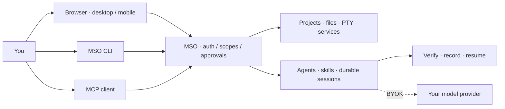

<h1 align="center">Manef Shell OS</h1>
<p align="center"><strong>A self-hosted control plane for AI agents.</strong></p>
<p align="center">Let agents work across your projects, tools, workflows and infrastructure while keeping context, permissions and execution evidence under your control.</p>
<p align="center"><a href="#see-it-work">Demo</a> · <a href="./docs/QUICKSTART.md">First 10 minutes</a> · <a href="#install-or-update-mso-from-this-repo">Install</a> · <a href="./docs/LAUNCH-READINESS.md">Launch readiness</a> · <a href="./docs/README.md">Docs</a></p>
<p align="center"><a href="https://github.com/rahmanef63/mso/actions/workflows/ci.yml"></a> <a href="https://github.com/rahmanef63/mso/actions/workflows/security-alerts.yml"></a></p>

## See it work

[](./docs/media/demo.gif)

*A recorded browser walkthrough, not a mockup. The GIF plays here; click to open it at full size.*

| Your server, visually | Your tools, in the terminal |
|---|---|
|  |  |

## More than an AI chat window

| Ask it to… | What MSO brings |
|---|---|
| **Understand a project** | Project context, trusted skills and task-specific tool discovery. |
| **Do the work** | Real PTY, bounded file tools, service controls and explicit approvals. |
| **Pick up where you left off** | Durable sessions, local memory, workflow evidence and agent handoffs. |
| **Build server-native workflows** | Server-native n8n-core workflow parity: schedule/webhook triggers, branching/loops/subflows, retries/error paths, versions/history, private variables, integrations, per-node logs, and automatic private learning. |

**One runtime, three ways in:** use desktop/mobile windows, stay in your terminal, or connect an MCP client.
Code, image/video tools, a browser and native credential setup live beside your operational tools.



[Private session screenshots](./docs/SESSION-ARTIFACTS.md) · [How the agent runtime works](./docs/COGNITIVE-RUNTIME.md) · [Architecture](./docs/ARCHITECTURE.md) · [Native Integrations](./docs/INTEGRATIONS.md)

## Install or update MSO from this repo
**Linux, macOS, Windows/WSL2, Android/Termux · iOS/iPadOS client.** MSO keeps one Linux host-runtime contract and adapts the machine around it.

| Machine | Supported path |
|---|---|
| Linux | Native host — canonical POSIX installer |
| macOS | Lima Linux guest — canonical POSIX installer auto-routes |
| Windows | WSL2 Linux distro — PowerShell bootstrap |
| Android | Termux + Ubuntu PRoot — canonical POSIX installer auto-routes |
| iOS / iPadOS | PWA/client to a protected MSO host |
```bash
curl -fsSL https://raw.githubusercontent.com/rahmanef63/mso/main/scripts/install.sh | bash
mso doctor
mso
mso web
```
Windows PowerShell: `iwr -useb https://raw.githubusercontent.com/rahmanef63/mso/main/scripts/install-windows.ps1 | iex`.

The raw application binds to **127.0.0.1** by default. Compatibility hosts manage their Linux runtime, not native parent-OS services. [Platform support](./docs/PLATFORMS.md) · [Full installation guide](./docs/INSTALL.md) · [Android / Termux details](./docs/TERMUX.md) · [CLI reference](./docs/CLI.md)

<details>
<summary><strong>Update, reset or uninstall — preview before changing anything</strong></summary>

`mso update` updates from main. `mso reset` and `mso reset --scope all` preview configuration/factory resets;
`mso uninstall --purge --remove-code` previews removal of owned data and a clean standalone clone.
Applying reset/uninstall requires an offline runtime and an exact confirmation token from an independent terminal.
Browser reset is separate in **Settings → About**. [Backups, scope and safeguards](./docs/MAINTENANCE.md).

</details>

## Use MSO from an AI app (MCP)

Connect ChatGPT, Codex, Claude Code, Cursor, or another compatible MCP client to your
MSO installation. **You do not need SI-Coder**: it is an optional MSO plugin, not the
MCP server or an installation prerequisite.

1. Open **Settings → MCP → Access MSO → Connect an app** and choose your client.
2. Copy the server URL shown there (`https://mso.example.com/mcp` is a placeholder),
   select **OAuth**, and authorize on an approved MSO owner device.
3. Grant the minimum useful scope, refresh/scan the client's tools, and enable MSO
   in the conversation. Start with: `@MSO check server status without changing anything`.

| Direction | What it does |
|---|---|
| **Access MSO** | Your AI app → MSO → permitted server/project operations. |
| **MSO Access** | MSO → external services/project MCPs with separately configured credentials. |

Fresh installs enable MCP with an `exec` ceiling; existing installs preserve their settings.
`read` observes, `write` adds bounded changes, and `exec` permits host/delegated execution.
A ceiling is not a grant: actual token scope and server guards still apply. Lower the ceiling
when shell access is unnecessary. Never paste passwords or tokens into a prompt.

[How to use MCP — Bahasa Indonesia](./docs/MCP-HOW-TO.md) · [ChatGPT setup/reference](./docs/CHATGPT-PLUGIN.md) · [Protocol and security](./docs/MCP.md) · [Generated tool catalog](./docs/generated/MCP-CATALOG.md)

## Build with it

```bash
bun install --frozen-lockfile
bun run verify
bun run test:features
bun run audit:strict
```

Use Bun >=1.2.15 with native audit support. [Contributing](./CONTRIBUTING.md) · [Development](./docs/DEVELOPMENT.md) · [Changelog](./docs/CHANGELOG.md)

## Powerful by design. Not a sandbox.

**Public Alpha / Developer Preview.** Owner/exec authority can run commands as the service user.
Provider calls may send selected context off-host. Review approvals and keep credentials private.
Successful analysis jobs are not proof of zero open alerts; the security badge above checks the actual inventory.
[Security policy](./SECURITY.md) · [Verification and known limits](./docs/SECURITY-ASSURANCE.md)

<!-- comparison:start -->
[Product comparison, evidence and limitations](docs/COMPARISON.md) · reviewed 2026-09-17.
<!-- comparison:end -->

[MIT license](./LICENSE) · [Detailed workspace guide](./docs/reference/WORKSPACE-GUIDE.md)
