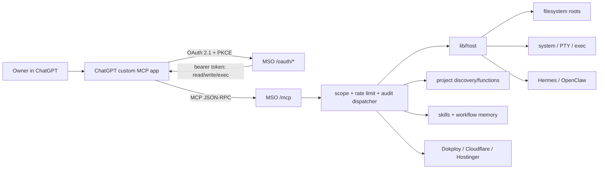
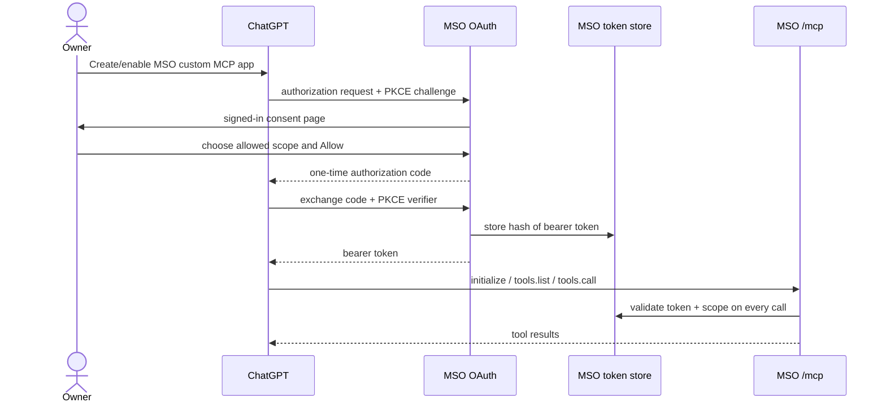
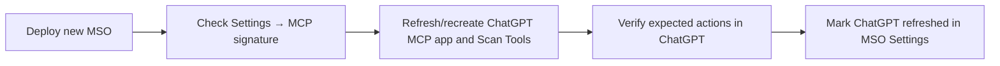
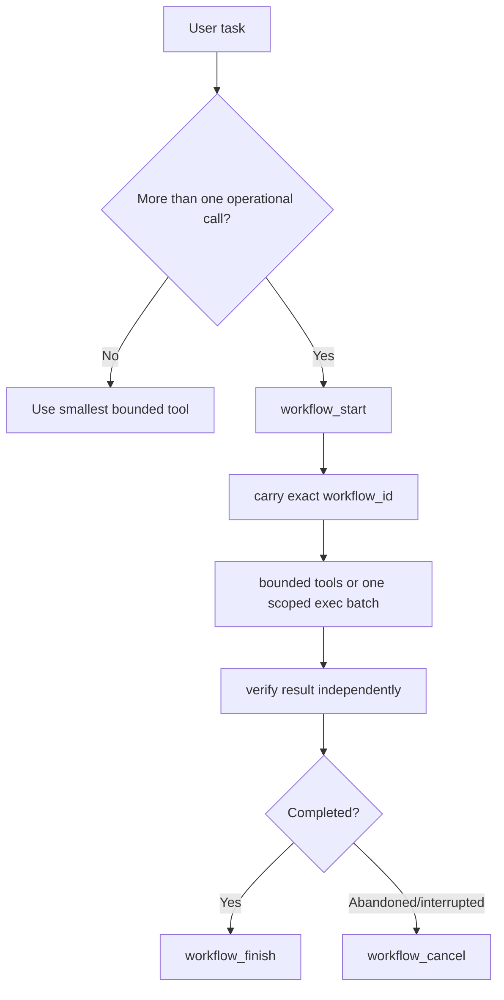
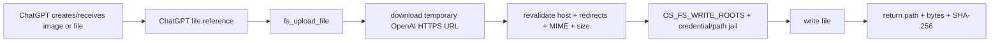

# ChatGPT plugin / custom MCP app for MSO

> **Current reference.** OpenAI currently exposes custom MCP setup through more than one product
> surface: the official Developer Mode guide uses **Apps → Create**, while ChatGPT Work and some
> plugin surfaces expose **Plugins → MCP / New Plugin**. The underlying MSO connection is the same
> remote MCP app/server. This is not a legacy ChatGPT Plugin manifest, browser extension, or a
> plugin installed inside Hermes/OpenClaw.
>
> ChatGPT's Developer Mode UI and permissions are controlled by OpenAI and can change during
> the MCP beta. Settings → MCP in MSO therefore shows the live endpoint, OAuth metadata and a
> guided setup instead of freezing one menu layout. Current OpenAI references:
> <https://help.openai.com/en/articles/12584461-developer-mode-and-mcp-apps-in-chatgpt-beta>
> and <https://help.openai.com/en/articles/20001256-plugins-in-chatgpt-and-codex>.

<!-- mcp-toolset: server=1.6.0 version=2026.09.02.4 tools=59 read=29 write=23 exec=7 -->

MSO currently exposes MCP server **1.6.0**, toolset **2026.09.02.4**: **60 transport tools** total; **59 model/operator tools**
(29 read, 23 write, 7 exec) plus app-only `workflow_status` for the progress widget. Use `GET /mcp` or Settings → MCP as the live authority if
this document and a deployed instance ever disagree.

## 1. What this connection does

The ChatGPT app lets ChatGPT call the MSO tool catalog on your server. OAuth controls which
tier the bearer token can use; MSO then applies the same host path, project, managed-app
and process guards used by its other surfaces.



The MCP client does **not** get a Linux credential or SSH key. It gets an MSO bearer token
whose scope is re-checked on every tool call.

## 2. Before connecting ChatGPT

You need:

1. a real owner MSO deployment over HTTPS;
2. an approved browser device that can open the MSO OAuth consent page;
3. `OS_MCP_ENABLED=1` on the running MSO service;
4. an intentional server ceiling, `OS_MCP_MAX_SCOPE=read|write|exec` (default is `exec`);
5. a ChatGPT plan/workspace that currently permits the MCP capability you need.

ChatGPT connects to a **remote** MCP server. A private-only MSO endpoint therefore needs a
reachable HTTPS path rather than an unreachable `localhost` URL. MSO's supported laptop path
is `mso gateway start` (temporary preview URL) or a named/custom-domain tunnel; the Next app
itself remains loopback-only instead of publishing port 4005 directly.

After changing MSO environment configuration, use the normal MSO update/rebuild path; do
not treat a Git push as deployment.

### Current ChatGPT availability (external, checked 2026-08-31)

OpenAI's current Developer Mode documentation says full MCP, including write/modify actions,
is rolling out in beta for Business, Enterprise and Edu workspaces and remains subject to
workspace/admin controls. The Plugin/App UI and entitlements are OpenAI product decisions and
can change independently of MSO, so Settings → MCP intentionally does not hard-code a plan
matrix. Check the current OpenAI article before treating any plan as entitled:
<https://help.openai.com/en/articles/12584461-developer-mode-and-mcp-apps-in-chatgpt-beta>.

MSO itself does not special-case ChatGPT plans. It publishes the same scoped MCP server; the
client decides which actions it will expose/allow.

## 3. MSO endpoint values

For an MSO origin such as `https://mso.example.com`:

| Purpose | Value |
|---|---|
| MCP server | `https://mso.example.com/mcp` |
| OAuth authorization | `https://mso.example.com/oauth/authorize` |
| OAuth token | `https://mso.example.com/oauth/token` |
| Dynamic client registration | `https://mso.example.com/oauth/register` |
| Authorization-server metadata | `https://mso.example.com/.well-known/oauth-authorization-server` |
| Protected-resource metadata | `https://mso.example.com/.well-known/oauth-protected-resource` |

MSO supports public OAuth clients with PKCE S256 and token-endpoint authentication method
`none`. ChatGPT can use the predefined public client id `chatgpt-mso`; a client secret is
not required. Other MCP clients can use Dynamic Client Registration where supported.

The exact ChatGPT form labels can change during the beta. The current MSO Settings → MCP
guide mirrors the common flow shown by OpenAI's Plugin/App UI:

1. enable Developer Mode for the account/workspace if required;
2. open Plugins or Apps and choose **New Plugin / Create**;
3. choose **Server URL** and paste the live MCP Server URL shown by MSO;
4. choose **OAuth**. MSO publishes the two `.well-known` documents automatically, uses PKCE
   S256, requires no client secret, and advertises token endpoint authentication `none`;
5. complete authorization in the browser, choose the lowest useful MSO scope, then return to
   ChatGPT and **Scan Tools / Create**;
6. enable the resulting MSO app/plugin from the tools or `+` menu in the chat before using it.

If ChatGPT shows the custom-server risk acknowledgement, review it rather than treating it as
an error. When the authorization browser opens, sign into MSO on an approved device and Allow
only the tier you intend.

## 4. OAuth lifecycle



Authorization codes live for 60 seconds and are consumed once. MCP bearer tokens expire
after 90 days unless revoked earlier. MSO stores token/code hashes, not reusable plaintext
bearers. The current authorization metadata advertises only `authorization_code`; MSO does
**not** issue refresh tokens. After a bearer expires (or is revoked), authorize the MCP app
again rather than expecting an offline refresh grant.

## 5. Scope ladder and exact tool catalog

A token sees a scope prefix; there is no per-project or per-agent hidden tool filter.
`tools/list` filters the catalog and `tools/call` independently re-checks the required
scope.

### `read` — 29 model/operator tools

- `a2a_agent_discover`
- `a2a_agents_list`
- `a2a_task_get`
- `agent_memory_read`
- `agent_memory_search`
- `agent_session_current`
- `agent_session_resume`
- `agent_sessions_list`
- `apps_list`
- `apps_logs`
- `browser_status`
- `cloudflare_zones_list`
- `dokploy_projects_list`
- `exec_job_status`
- `fs_list`
- `fs_read`
- `fs_search`
- `fs_usage`
- `infra_provider_doctor`
- `infra_providers_list`
- `project_capabilities`
- `projects_list`
- `screen_capture`
- `skills_list`
- `skills_read`
- `skills_search`
- `sys_processes`
- `sys_stats`
- `tool_forge_candidates`
### `write` — read + 23 tools

- `a2a_agent_register`
- `a2a_agent_remove`
- `a2a_message_send`
- `a2a_task_cancel`
- `a2a_handoff`
- `agent_memory_forget`
- `agent_memory_remember`
- `agent_session_note`
- `agent_session_rename`
- `apps_power`
- `cloudflare_dns_upsert`
- `dokploy_project_ensure`
- `fs_copy`
- `fs_delete`
- `fs_mkdir`
- `fs_move`
- `fs_upload_file`
- `fs_write`
- `hostinger_dns_upsert`
- `tool_forge_propose`
- `workflow_cancel`
- `workflow_finish`
- `workflow_start`

### `exec` — write + 7 tools

- `browser_power`
- `exec_job_cancel`
- `exec_job_start`
- `exec_run`
- `project_function_call`
- `tool_forge_evaluate`
- `tool_forge_promote`

`exec_run` is full host shell power as the MSO service user. The command filter is an
accident tripwire, not a sandbox. Grant `exec` only to a ChatGPT app/workspace you trust
with the same care as a remote shell.


### Tool Forge approval model

`tool_forge_propose` creates only inert candidates from repeated verified workflow recipes. Skill candidates are guidance only; a project-function candidate must point to an existing project-owned Node script and must come from an exec-scope verified recipe. Generated shell/code, credential-like fixture data, and implicit scope escalation are rejected.

`tool_forge_evaluate` runs executable fixtures only in the labelled local MSO Forge Docker sandbox. `tool_forge_promote` requires exact `PROMOTE <candidate_id>` confirmation and a fresh passing evaluation immediately before mutation. Candidate hash, target manifest, current toolset, project source SHA-256 and exact sandbox image evidence are checked again, and existing Skills/functions are never overwritten. Provision the local sandbox explicitly with `bun run forge:sandbox`; evaluation never auto-pulls an image.

### Infrastructure-provider actions

The infrastructure tools never accept API tokens as arguments. ChatGPT sees masked provider
status, then MSO loads Dokploy/Cloudflare/Hostinger credentials server-side for the approved
call. `cloudflare_dns_upsert` changes one exact record and defaults proxying off.
`hostinger_dns_upsert` uses Hostinger's scoped overwrite semantics: MSO sends one exact name/type RR-set rather than a full-zone
snapshot; unrelated rows are never included in the mutation payload and ambiguous/conflicting records are refused, but the action
still deserves the same scrutiny as any external infrastructure mutation. Configure providers
locally with `mso provider set <id>` rather than pasting credentials into a ChatGPT message.


### A2A peer delegation

ChatGPT can use `a2a_agent_discover`/`a2a_agents_list` to find peers, then the write-scope
`a2a_message_send` or `a2a_handoff` to delegate explicit work. `a2a_task_get` polls the remote
task and `a2a_task_cancel` requests cancellation; register/remove only mutate MSO's local public
Agent Card registry. MSO never auto-forwards this ChatGPT conversation, private agent memory, or
raw MSO session/workflow ids to a peer. Current A2A is outbound/public-HTTPS/anonymous only and
fails closed for Agent Cards that require credentials. See [`A2A.md`](./A2A.md).

## 6. Tool-snapshot refresh: the part most often missed

ChatGPT scans and caches the MCP action definitions. If MSO adds/removes/changes tools, a
running ChatGPT app may continue using its previous snapshot until you refresh/recreate the
app according to the current ChatGPT workspace controls.

MSO exposes a schema-derived signature in `GET /mcp`, MCP `initialize`, `tools/list`, and
Settings → MCP:

```text
server:  1.6.0
toolset: 2026.09.02.3
hash:    <live schema hash>
count:   59 model/operator tools (+ 1 app-only bridge)
```

Use this sequence after an MSO MCP change:



**Mark ChatGPT refreshed** is only an operator acknowledgement stored by MSO. It does not
reach into ChatGPT and refresh anything by itself.

OpenAI's current beta controls differ by plan: a published Business custom app must be
recreated/republished to change tools or metadata, while Enterprise/Edu admins can use the
workspace **Refresh** / action-control flow to pull new or changed definitions. New actions
are not automatically enabled. Always follow the current workspace UI if OpenAI changes
this behaviour.

## 7. Conversation identity, durable context, and `workflow_id`

ChatGPT conversation state is not the OAuth token and is not the HTTP transport session.
For `tools/call`, MSO reads the host-provided `_meta["openai/session"]` when present, derives
a privacy-safe SHA-256 correlation value with the stable MCP client principal, and stores only
that digest. The raw opaque ChatGPT conversation id is never persisted or written to audit.
`Mcp-Session-Id` remains a compatibility fallback for older/generic clients; transport-id
rotation does not split a ChatGPT conversation when `openai/session` is available.

Each conversation receives its own durable MSO Agent session and therefore its own active
workflow/job ownership boundary. Learned successful recipes remain client-principal scoped, so
conversation B may benefit from a verified recipe learned in conversation A without being able
to finish/cancel A's live workflow. `agent_session_current`, `agent_sessions_list`,
`agent_session_resume`, `agent_session_note`, and `agent_session_rename` expose only safe MSO
operational context; they cannot recover ChatGPT's hidden transcript. Persistent `USER.md` /
`MEMORY.md` are frozen into each new session.

Durable session context has a provider-neutral estimated-token counter. The default compaction
threshold is **700,000 tokens**; compaction preserves a structured summary plus about **140,000
recent tokens**, and first writes a recursively redacted gzip backup. Archives default to
**30-day retention** and are pruned both after archival and at MSO boot. The CLI can continue a
ChatGPT/MCP session via `mso --resume <id-or-title>`; continuation is copy-on-resume rather than
two surfaces mutating one session file.

### Multi-step work and `workflow_id`

For a task needing several operational calls, ChatGPT should call `workflow_start` once.
The returned exact `workflow_id` is then included on later operational calls. Missing id =
a standalone call; an unknown id is refused.



Successful runs can become redacted local recipes. MSO never stores raw file bodies,
`fs_write.content`, bearer tokens, browser credentials or secret-looking command payloads
in workflow memory.

## 8. ChatGPT file/image → VPS bridge

`fs_upload_file` is intentionally ChatGPT-aware through MCP metadata
`openai/fileParams`. The normal flow is:



Current guardrails:

- write scope is required;
- maximum 20 MiB, enforced while streaming even without a trustworthy `Content-Length`;
- PNG, WebP, JPEG or generic octet-stream only;
- response MIME is allowlisted; PNG/JPEG/WebP bytes must match their declared signature;
- temporary URL must be from an allowed OpenAI content/storage host;
- up to three redirects, and each redirect target is revalidated;
- destination still has to be inside `OS_FS_WRITE_ROOTS` and pass the credential/path jail;
- filename is sanitized and the write uses an exclusive random temporary file plus atomic rename;
- transferred bytes are never executed automatically by MSO;
- an existing same-name file can be replaced, so treat this as a write/destructive action;
- result includes byte count and SHA-256.

MSO does **not** provide a second image generator. Generate with ChatGPT's native image
capability, then use this bridge to move the result into the VPS when needed.

## 9. Visual proof without arbitrary browser access

`screen_capture` captures only the authenticated MSO UI. It cannot be pointed at an
arbitrary URL. It supports macOS, Windows or Dashboard shells, 900–1920 px width and
600–1200 px height.

The call returns the MCP image directly plus a session-gated temporary preview/download
link. The link expires after 15 minutes or 5 authenticated downloads, whichever comes
first. This is intended for visual verification while avoiding a general read-token web
exfiltration primitive.

Camoufox is a separate capability. `browser_status` reveals only installed/running/autostart
state. The VNC password, logged-in profile and cookies are deliberately never returned to
an MCP client.

## 10. Project-aware tools

`projects_list` discovers validated projects across configured containers. Scans are
bounded and may return a continuation cursor; never interpret a truncated scan as "the
project does not exist".

`project_capabilities` can report:

- `.mcp.json` **presence only** — contents may contain credential wiring and are never
  returned; MSO does not auto-connect arbitrary project MCP servers;
- `.mso/functions.json` — public schemas for a version-1 project function manifest.

A function manifest can declare at most 32 functions. Functions use fixed argv (at most 16
strings), a maximum 30-second timeout, and receive caller JSON on stdin. User values are not
interpolated into a shell command. `project_function_call` always requires `exec` scope,
even when a project function is named "read".

## 11. Four credentials people commonly confuse

```mermaid
flowchart TB
  S[MSO browser session cookie] -->|human UI| UI[MSO web app]
  B[MCP bearer token] -->|ChatGPT permission to MSO tools| MCP[/mcp]
  K[BYOK API key] -->|Alfa model inference| API[Model provider API]
  C[Alfa openai-codex OAuth] -->|Alfa model inference| COD[ChatGPT Codex backend]
```

| Credential | Purpose | Does not grant |
|---|---|---|
| MSO session cookie | human browser access | MCP access by itself |
| MCP bearer | external client access to scoped MSO tools | an Alfa model credential |
| BYOK provider API key | Alfa inference | permission for ChatGPT to operate MSO |
| Alfa `openai-codex` OAuth | Alfa inference via ChatGPT subscription backend | MSO MCP scope |

Authorizing the ChatGPT MCP app therefore does **not** automatically configure Alfa, and
"Sign in with OpenAI" under Alfa provider settings is not the ChatGPT plugin setup.

## 12. Security model

- Connect only an MSO server you own and trust.
- Start with `read` unless the workflow actually needs host changes.
- `write` can change/delete files and control bounded managed apps.
- `exec` is effectively a remote shell as the MSO Linux user.
- Prompt injection still matters: data read from files/logs can influence the model. Scope
  is the server-side boundary that prevents a read-only token from turning that influence
  into a write/exec.
- Tool inputs/results used in a ChatGPT conversation are processed by ChatGPT according to
  the user's/workspace's OpenAI data controls; do not assume an MCP call stays on the VPS.
- Revoke old tokens from Settings → MCP. Tokens also expire after 90 days.
- Do not publish the MSO bearer, OAuth store, browser profile or `~/.mso` contents.

OpenAI may additionally ask for confirmation or block some write actions based on the
ChatGPT app/workspace permission model. That is an additional client control; it does not
replace MSO's own scope checks.

## 13. Troubleshooting

### ChatGPT cannot discover the server

- the endpoint must be remote/reachable from ChatGPT;
- use HTTPS;
- verify `OS_MCP_ENABLED=1` is present in the **running** service;
- `GET /mcp` should return the public descriptor instead of 404.

### OAuth page opens but cannot authorize

The authorization page is a real MSO browser page. Log into MSO from an approved device,
then retry the connector authorization. Check the requested scope against
`OS_MCP_MAX_SCOPE`.

### ChatGPT sees old/missing tools after a deploy

Compare the toolset signature in Settings → MCP or `GET /mcp`, then refresh/recreate the
ChatGPT app and run **Scan Tools**. Only after ChatGPT shows the new actions should you mark
it refreshed in MSO Settings.

### A tool is visible but returns a scope error

The token was authorized at a lower tier than that action requires. Reauthorize deliberately
at the needed scope; do not raise the whole server ceiling only to silence the error.

### `fs_upload_file` fails

Check destination write roots, file size/type, and whether ChatGPT supplied a current file
reference. Temporary OpenAI URLs expire; retry from the actual attached/generated file
rather than pasting an arbitrary public URL.

### Project/skill seems missing

Inspect the returned scan report. If `truncated:true`, follow its continuation cursor.
Project and skill discovery are deliberately bounded.

## 14. Deeper reference

- `docs/MCP.md` — protocol, OAuth store, tool internals, project/skill discovery, rate limits
- `docs/ARCHITECTURE.md` — whole-system boundaries
- `docs/CONNECTORS-GATEWAY-INTEGRATION.md` — cross-repo action-name contract
- `docs/MODELS-INTEGRATION.md` — Alfa model credentials and the separate Codex OAuth flow
- `SECURITY.md` — deployment/security posture


### Bounded asynchronous execution

`exec_job_start` starts a client/workflow-bound command that may run up to 20 minutes; `exec_job_status` reads its bounded output and final exit state; `exec_job_cancel` stops a still-running job. Use this trio for test/build pipelines instead of wrapping `exec_run` in host-specific background-process plumbing.
