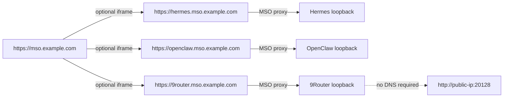

# Managed applications

> **Current reference.** MSO currently manages three independent applications:
> **Hermes**, **OpenClaw**, and **9Router**.

Managed applications are separate runtimes with their own install, config, data and
privileges. MSO does not turn them into MSO slices. It provides a management layer around
their existing CLI/systemd/Docker/dashboard interfaces.

```mermaid
flowchart LR
  U[MSO owner] --> M[Managed Apps UI]
  M --> API[/api/v1/managed-apps/*]
  API --> C[lib/managed-apps]
  C --> S[systemd / Docker / CLI probes]
  C --> J[persisted job runner]
  C --> B[backup + restore]
  C --> P[optional dashboard proxy]
  S --> H[Hermes]
  S --> O[OpenClaw]
  S --> N[9Router]
  J --> H
  J --> O
  J --> N
  P --> H
  P --> O
  P --> N
```

## 1. Current application model

| App | MSO-managed runtime | Internal dashboard upstream | Direct browser access | State directory |
|---|---|---|---|---|
| Hermes | user systemd (`hermes-dashboard.service`, `hermes-gateway.service`) | `127.0.0.1:9119` by default | none by default | `~/.hermes` or `HERMES_HOME` |
| OpenClaw | user systemd (`openclaw-gateway.service`) | `127.0.0.1:18789` by default | none by default | `~/.openclaw` |
| 9Router | Docker container `9router` | `127.0.0.1:20128` by default | `http://<public-ip>:20128` when the host has a global IPv4 | `~/.9router` mounted at `/app/data` |

Detection reads systemd first, then Docker/package evidence. If MSO cannot reach the user
systemd bus, it reports that uncertainty instead of silently treating a running app as
"not installed". Install and restore fail closed when required state cannot be proven.

9Router upstream publishes **both** an npm CLI and Docker images. MSO deliberately manages
the Docker distribution on servers/VPSes; this matches upstream's server/VPS quick start and
avoids starting a second 9Router process on the same port. The repo-owned
`scripts/managed-app-9router` is an MSO lifecycle/update adapter, not the upstream CLI.

## 2. User experience

Opening a managed app first detects it:

- **not installed** → one-click Install surface;
- **installed but stopped** → Start surface;
- **running/starting/unhealthy** → the app surface;
- **Details** → MSO-owned lifecycle, logs, update, backup/restore and uninstall controls.

The app surface can switch between **UI** and **CLI** where a UI is available. Hermes and
OpenClaw use their safe split-origin embedded dashboard when configured. 9Router follows the
same rule: **a configured application domain is the primary in-shell UI**. Its Docker runtime
also publishes port `20128`, so MSO advertises the direct
separate-origin URL and opens it in a dedicated browser tab. This requires no domain, DNS
provider, wildcard record, or TLS configuration.

When no domain is configured, MSO intentionally does not iframe `http://<public-ip>:20128` inside an HTTPS cockpit: browsers
block that as mixed content. It also does not proxy a vendor SPA under the cockpit origin,
because a same-origin SPA with `allow-same-origin` could reach the owner's MSO session/API.

For 9Router's CLI view MSO starts with `docker logs --tail 80 9router`, then leaves the shell
interactive. It does **not** auto-run `9router` (which starts another server) and does not use
the nonexistent `9router status` command.

## 3. Lifecycle versus jobs

Short lifecycle actions are bounded synchronous operations:

- `start`
- `stop`
- `restart`
- `backup`

Install, update, uninstall and restore can outlive one HTTP request. They run as persisted
managed-app jobs with states `queued`, `running`, `succeeded`, `failed` or `interrupted`, a
bounded transcript, heartbeat/liveness data and app ownership. Closing the MSO window does
not cancel a running job.

The public managed-app API is:

| Route | Purpose |
|---|---|
| `GET /api/v1/managed-apps` | detect/list Hermes, OpenClaw and 9Router |
| `GET /api/v1/managed-apps/[id]` | detect/read one managed app |
| `POST /api/v1/managed-apps/[id]` | start/stop/restart/backup |
| `GET /api/v1/managed-apps/[id]/logs` | recent logs |
| `GET /api/v1/managed-apps/[id]/backups` | snapshot list |
| `POST /api/v1/managed-apps/[id]/install` | start install job |
| `GET/POST /api/v1/managed-apps/[id]/update` | update status and actions |
| `GET /api/v1/managed-apps/[id]/jobs` | job history/current work |
| `GET/DELETE /api/v1/managed-apps/[id]/jobs/[jobId]` | job status/cancel where supported |
| `/api/v1/managed-apps/[id]/proxy/*` | authenticated optional vendor-dashboard reverse proxy |

There is intentionally no `/features` endpoint.

## 4. Install

MSO installs all three apps non-interactively through `scripts/managed-app-install` and the
same persisted job layer used for updates.

- **Hermes/OpenClaw** use their upstream installers and user-systemd lifecycle.
- **9Router** delegates to `scripts/managed-app-9router`, pulls `decolua/9router:latest`,
  creates `~/.9router`, and runs the container with `--restart unless-stopped`,
  `-p 20128:20128`, and `~/.9router:/app/data`.

A domain is **not an install prerequisite**. In particular, 9Router is usable through the
VPS public IP immediately after its health check succeeds. Domain-provider integrations
(Cloudflare, Hostinger, etc.) are a separate optional concern and are not called by the
managed-app installer.

An optional model-provider API key can be supplied to app installers that support it. Keys
are passed through the child environment rather than persisted job argv/transcripts.

## 5. Update centre

Every real update takes an MSO state snapshot first. If that snapshot fails, the update is
abandoned before invoking the upstream updater.

### Hermes

- supports check + apply;
- upstream has no true update dry-run; its read-only check is the preview;
- branch switching exists upstream but is not presented as an ordinary channel menu.

### OpenClaw

- supports check + apply + real `--dry-run`;
- supports channels/tags and exact-version pinning within MSO's allowlist;
- normal update restarts and verifies the app rather than leaving new bytes behind an old
  process.

### 9Router

- `/api/version` supplies current/latest/update-available state;
- apply pulls the configured Docker image and recreates the `9router` container;
- the `~/.9router` data mount is preserved across recreation;
- upstream's `latest` image is the managed channel, so MSO does not expose a fake channel
  or version-pin control that upstream does not provide in this install mode.

Update commands use argv arrays, not shell interpolation. User-supplied values pass explicit
validation first.

## 6. Backups

Snapshots live under:

```text
~/.mso/backups/<app>/<timestamp>/
```

They may contain credentials and should be protected like the app's original state. The
snapshot directory is private and its manifest is `0600`.

Snapshots skip symlinks and recursively exclude reinstallable/cache trees such as
`node_modules`, `.venv`, `venv`, `__pycache__`, `.git`, `.cache`, and nested `backups`.
The manifest records the app, original source path, reason, file/byte counts and exclusions.

For 9Router the important persistent state is `~/.9router`; the container itself is
reinstallable and is not the backup target.

## 7. Restore

Restore is intentionally conservative.

1. MSO must prove the app is stopped; an uncertain systemd reading is a refusal.
2. Backup id and manifest must identify this app and its current state directory.
3. Target state directory must be a real safe directory, not a symlink or home ancestor.
4. MSO checks the snapshot/target trees for symlink collisions **before** writing.
5. MSO first creates a `pre-restore` safety snapshot of current state.
6. Snapshot files overwrite matching files.
7. Files created after the snapshot are **not deleted**.
8. Excluded reinstallable/cache directories were never in the snapshot and are not restored.

Restore is therefore an overwrite restore, not a byte-for-byte directory replacement.

## 8. Uninstall

MSO takes a backup first and uses conservative removal scopes.

- Hermes removal keeps its state/config by default.
- OpenClaw removal targets its gateway service + local state within the supported scope.
- 9Router removal stops/removes only the `9router` container. The image and `~/.9router`
  state stay, so reinstalling can return with existing providers/keys/stats.

The UI can preview removal when the adapter proves dry-run support, and server-side
confirmation is still required for a real removal.

## 9. Browser access and dashboard origin boundary

**Lifecycle does not require a domain.** These are separate concerns:

1. **Runtime management** — install/start/stop/update/backup/uninstall; no DNS required.
2. **Direct public access** — fallback for 9Router when no embeddable domain is configured; its server distribution is
   deliberately published on host port `20128`; MSO derives a globally-routable IPv4 from
   local network interfaces and returns `publicDashboardUrl`.
3. **Embedded dashboard access** — preferred when configured: split-origin mode for a vendor UI shown inside
   MSO.

The safe embedded-dashboard default is **off**. To opt in, configure all parts of one
split-origin decision:

```dotenv
NEXT_PUBLIC_MANAGED_APP_HOST_TEMPLATE={id}.mso.example.com
OS_SESSION_COOKIE_DOMAIN=.mso.example.com
OS_PUBLIC_ORIGIN=https://mso.example.com
```

Then provision DNS/TLS only for managed-app hostnames you actually use (for the current
catalog: `hermes`, `openclaw`, and optionally `9router`). Each hostname is rewritten
exclusively into that app's proxy; cockpit pages/API/static chunks are not served there.



Why the split exists: vendor SPAs need `allow-same-origin` to work. If their JavaScript
shared the cockpit origin, it would share the owner's browser realm/session. A separate
hostname makes `window.top` cross-origin. There is no supported same-origin dashboard
fallback.

Never map an arbitrary wildcard hostname to MSO under the session-cookie domain. Provision
only explicit names you intend to serve. Setting the cookie domain without the matching host
gating widens where the session credential is sent.

## 10. 9Router distribution and ownership

Upstream's npm package remains a valid desktop/local way to run 9Router:

```bash
npm install -g 9router
9router
```

That is **not** the runtime MSO owns on a VPS. Running the npm launcher beside the Docker
container can contend for port `20128`, and sharing `~/.9router` between root-written Docker
runtime artifacts and an npm updater can also create ownership problems. MSO therefore keeps
one authority: Docker for the server runtime, with the repo-owned adapter for lifecycle.

See [`9ROUTER-INTEGRATION.md`](./9ROUTER-INTEGRATION.md) for the app-specific contract.

## 11. Project ingress is separate

`OS_PROJECT_INGRESS_ROUTES` is not part of managed-app dashboard management. It is a generic
opt-in seam for exact project-owned POST callbacks. It defaults empty, targets loopback
services only, and applies an HMAC-shaped request prefilter. The target project still owns
the real secret verification.

## 12. Troubleshooting quick map

- app says "not installed" but you know it exists → check systemd-user visibility/detection
  evidence before rerunning an installer;
- 9Router is healthy but its configured `*.mso...` host fails → diagnose DNS/TLS/session-cookie state; the runtime remains healthy and the direct public-IP UI is the fallback;
- 9Router UI button has no public URL → the host has no globally-routable IPv4 on a local
  interface, or the runtime was deliberately changed to loopback/private-only networking;
- dashboard frame missing but service is healthy → split-origin embedding may be absent by
  design; Details and direct access (where defined) still work;
- update refused → inspect the pre-update backup error first;
- restore refused → stop the app and resolve state-path/symlink diagnostics;
- long update appears to vanish → reopen Details; job state/transcript is server-side.
