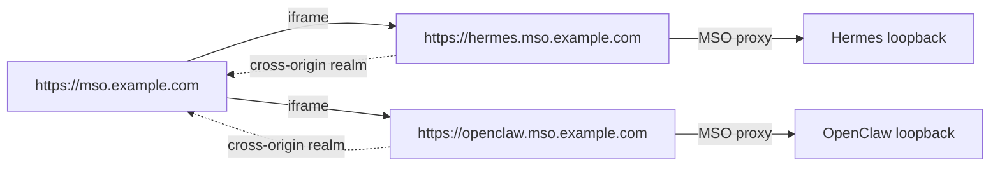

# Managed applications

> **Current reference.** MSO currently manages exactly two independent applications:
> **Hermes** and **OpenClaw**. Older workspace-mode and dynamic upstream-feature-discovery
> designs are historical; there is no `/features` route in the current API.

Managed applications are separate daemons with their own install, config, data and
privileges. MSO does not turn them into MSO slices. It provides a management layer around
their existing CLI/systemd/dashboard interfaces.

```mermaid
flowchart LR
  U[MSO owner] --> M[Managed Apps UI]
  M --> API[/api/v1/managed-apps/*]
  API --> C[lib/managed-apps]
  C --> S[systemd / Docker / CLI probes]
  C --> J[long-running job runner]
  C --> B[backup + restore]
  C --> P[dashboard proxy]
  S --> H[Hermes]
  S --> O[OpenClaw]
  J --> H
  J --> O
  P --> H
  P --> O
```

## 1. Current application model

| App | Primary service(s) | Dashboard upstream | State directory |
|---|---|---|---|
| Hermes | `hermes-dashboard.service`, `hermes-gateway.service` | `127.0.0.1:9119` by default | `~/.hermes` or `HERMES_HOME` |
| OpenClaw | `openclaw-gateway.service` | `127.0.0.1:18789` by default | `~/.openclaw` |

Detection reads systemd first, then Docker/package evidence. If MSO cannot reach the user
systemd bus, it reports that uncertainty instead of silently treating a running app as
"not installed". Install and restore fail closed when the required state cannot be proven.

## 2. User experience

Opening Hermes/OpenClaw first detects the app:

- **not installed** → Install surface;
- **installed but stopped** → Start surface;
- **running/starting/unhealthy with a reachable dashboard** → vendor dashboard surface;
- **Details** → MSO-owned management surface regardless of vendor UI.

The Details surface exposes lifecycle state, version, health, logs, update centre and
backups. It does not scrape the vendor's internal navigation into MSO launcher items.

## 3. Lifecycle versus jobs

Short lifecycle actions are bounded synchronous operations:

- `start`
- `stop`
- `restart`
- `backup`

Install, update, uninstall and restore can outlive one HTTP request. They run as persisted
managed-app jobs with states `queued`, `running`, `succeeded`, `failed` or `interrupted`,
a bounded transcript, heartbeat/liveness data and app ownership. Closing the MSO window
does not cancel a running job.

The public managed-app API is:

| Route | Purpose |
|---|---|
| `GET /api/v1/managed-apps` | detect/list Hermes and OpenClaw |
| `GET /api/v1/managed-apps/[id]` | detect/read one managed app |
| `POST /api/v1/managed-apps/[id]` | start/stop/restart/backup |
| `GET /api/v1/managed-apps/[id]/logs` | recent logs |
| `GET /api/v1/managed-apps/[id]/backups` | snapshot list |
| `POST /api/v1/managed-apps/[id]/install` | start install job |
| `GET/POST /api/v1/managed-apps/[id]/update` | update status and actions |
| `GET /api/v1/managed-apps/[id]/jobs` | job history/current work |
| `GET/DELETE /api/v1/managed-apps/[id]/jobs/[jobId]` | job status/cancel where supported |
| `/api/v1/managed-apps/[id]/proxy/*` | authenticated vendor-dashboard reverse proxy |

There is intentionally no `/features` endpoint.

## 4. Install

MSO can install both apps non-interactively through `scripts/managed-app-install` and the
same job layer used for updates. An optional model-provider API key can be supplied during
install. The key is accepted in the request body, passed to the child through its
environment and immediately dropped from React state; it is not put in argv, job records or
MSO's audit transcript.

The UI keeps a manual install command visible as a recovery path if automation cannot work
on another host.

## 5. Update centre

Every real update takes an MSO state snapshot first. If that snapshot fails, the update is
abandoned before invoking the upstream updater.

### Hermes

- supports check + apply;
- upstream has no true update dry-run; its read-only check is the preview;
- branch switching exists upstream but is not presented as an ordinary channel menu;
- MSO deliberately does **not** combine a restored state snapshot with an automatic Hermes
  branch/version pin, because Hermes' git/stash behaviour can overwrite the state just
  restored.

### OpenClaw

- supports check + apply + real `--dry-run`;
- supports channels/tags and exact-version pinning within MSO's allowlist;
- normal update restarts and verifies the app rather than leaving new bytes behind an old
  process.

Update commands use argv arrays, not shell interpolation. User-supplied branch/channel/tag
values pass explicit validation first.

## 6. Backups

Snapshots live under:

```text
~/.mso/backups/<app>/<timestamp>/
```

They may contain credentials and should be protected like the app's original state. The
snapshot directory is private and its manifest is `0600`.

Snapshots skip symlinks and recursively exclude reinstallable/cache trees:

- `node_modules`
- `.venv`
- `venv`
- `__pycache__`
- `.git`
- `.cache`
- `backups`

The manifest records the app, original source path, reason, file/byte counts and exclusions.

## 7. Restore

Restore is implemented and intentionally conservative.

1. MSO must prove the app is stopped; an uncertain systemd reading is a refusal.
2. Backup id and manifest must identify this app and its current state directory.
3. Target state directory must be a real safe directory, not a symlink or home ancestor.
4. MSO checks the snapshot/target trees for symlink collisions **before** writing.
5. MSO first creates a `pre-restore` safety snapshot of the current state.
6. Snapshot files overwrite matching files.
7. Files created after the snapshot are **not deleted**.
8. Excluded reinstallable/cache directories above were never in the snapshot and therefore
   are not restored.

That means restore is an overwrite restore, not a byte-for-byte directory replacement. The
result explicitly reports the safety-backup id and excluded content.

## 8. Uninstall

MSO only exposes conservative upstream uninstall scopes and takes a backup first.

- Hermes removal keeps its state/config by default; MSO does not expose the destructive
  full-state removal flag.
- OpenClaw removal targets its gateway service + local state; MSO does not add the workspace
  removal scope.
- The UI can preview the upstream removal when the installed CLI proves it supports the
  dry-run flag, and server-side confirmation is still required for a real removal.

A later reinstall is a fresh installation; use the MSO snapshot if you need the previous
credentials/pairings/history back.

## 9. Dashboard origin boundary

The safe default is **no embedded vendor dashboard**. To embed them, configure both halves
of one split-origin decision:

```dotenv
NEXT_PUBLIC_MANAGED_APP_HOST_TEMPLATE={id}.mso.example.com
OS_SESSION_COOKIE_DOMAIN=.mso.example.com
OS_PUBLIC_ORIGIN=https://mso.example.com
```

Then route only the known app hostnames to the same MSO process. Each managed-app hostname
is rewritten exclusively into that app's proxy; cockpit pages/API/static chunks are not
served there.



Why this exists: vendor SPAs need `allow-same-origin` to work. If the vendor JavaScript
shared the cockpit origin, it would have the owner's browser realm and session. A separate
hostname makes `window.top` cross-origin. This is a browser-realm boundary only; a plugin
installed **inside Hermes/OpenClaw** still runs with that daemon's host privileges.

There is no supported same-origin dashboard fallback. If the two split-origin environment
variables are unset, MSO leaves vendor dashboards unembedded and the management UI remains
usable.

## 10. Proxy properties

The dashboard proxy is not a generic forward proxy. It resolves only the catalogued
loopback upstream for the selected managed app. It rewrites response headers and cookies
for the app host, strips/adjusts headers that would block the intended frame, and applies a
CSP that keeps the upstream app within its own realm while allowing the cockpit to frame
it.

Never map an arbitrary wildcard hostname to MSO under the cookie domain. Provision only
hostnames you explicitly intend to serve.

## 11. Project ingress is a separate feature

`OS_PROJECT_INGRESS_ROUTES` is not part of Hermes/OpenClaw dashboard management. It is a
generic opt-in seam for exact project-owned POST callbacks. It defaults empty, is capped at
eight exact routes, targets loopback services only, and applies an HMAC-V2-shaped request
prefilter. The target project still owns the real secret verification.

## 12. Troubleshooting quick map

- state says "not installed" but you know it is running → check whether MSO can reach the
  user's systemd bus; do not rerun an installer until detection is trustworthy;
- dashboard frame missing but service is healthy → split-origin config/DNS/proxying may be
  intentionally absent; the Details surface still works;
- update refused → inspect the pre-update backup error first;
- restore refused → stop the app and resolve any state-path/symlink diagnostic rather than
  bypassing the gate;
- long update appears to vanish → reopen Details; job state/transcript is server-side.

See the per-app references for upstream-specific behaviour.
