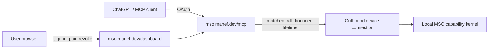

# Native MSO hosts and shared remote MCP

> Implementation contract. This describes the requested target, not a shipped capability. Current release uses native Linux, Lima on macOS, WSL2 on Windows, and per-installation HTTPS for remote MCP.

## Product target

MSO installs and hosts directly under the user's ordinary account in macOS Terminal, a Linux shell, or Windows PowerShell. No Lima, WSL, Docker, VM, mandatory VPS, personal domain, or public inbound port. The same bounded host capability kernel serves local UI, CLI, and MCP. OS-specific operations expose honest availability instead of pretending that systemd or Linux /proc exists.

The public, shared control plane uses **mso.manef.dev**: `/dashboard` is the user and device console, `/mcp` is one HTTPS Streamable HTTP endpoint with OAuth. The local MSO agent makes an outbound TLS connection to that relay. Each user signs into the shared service and pairs only their own devices. MSO installations stay loopback-bound; the relay cannot read a local file or issue a host command by itself.

The current personal MSO installation at mso.rahmanef.com must remain independent. Do not redirect mso.manef.dev or expose `/mcp` as a relay until the shared service is deployed and ownership isolation is verified. A missing DNS record is not a functioning gateway.

## Native host boundaries

| Platform | Direct install | Terminal | Service | Host differences |
|---|---|---|---|---|
| Linux | Verified POSIX installer | Bash / installed shell | systemd if available, foreground otherwise | Existing Linux capability set |
| macOS | Native Node/Bun/Git and native build dependencies | zsh / Bash / selected shell | launchd or foreground | macOS metrics, process inventory, filesystem and service adapters |
| Windows | Native Node/Bun/Git and node-pty Windows binding | PowerShell | Windows Service or foreground | Win32 paths, process inventory, shell, permissions and service adapters |

Installer acceptance: fresh install and in-place update without a guest; no hidden second checkout; preserve authentication, config and local state; build and start on each architecture; `mso doctor`, PTY, file allowlist, execution, login, MCP, shutdown and restart succeed. Native macOS/Windows remain unverified until real-machine smoke runs pass.

## Shared relay

- The shared service is a separate trust domain from the user's host. Accounts, clients, grants and devices are keyed by the authenticated account, and every lookup repeats that check.
- Pair with a short-lived one-time code confirmed in the browser and on the device. Store only token hashes; rotate device credentials and support immediate device/client revocation.
- Remote MCP uses existing `read < write < exec` semantics. Start at read. A user's explicit grant and the device's local ceiling must both allow a call; tool discovery and dispatch enforce the same effective scope.
- Calls and results are transient, bounded in bytes and time, correlated by an unguessable request ID, and dropped when the device disconnects. Never log payloads, shell input, file bodies, OAuth codes or raw tokens.
- Device selection is explicit with stable user-visible names; multiple devices cannot silently substitute for one another. Offline devices fail clearly, and no relay job silently wakes a host.
- Bind OAuth grants to the shared MCP resource and the authenticated account. Separate relay OAuth identities from each machine's owner login and preserve per-device local authorization.
- HTTPS, rate limits, origin checks, CSRF protection on the dashboard, secure cookies, audit metadata, and cross-account denial are release gates. Transport security alone is not an authorization boundary.
- Keep an optional private direct-host MCP route for an owner who already has a domain. The shared route is the no-domain default.

## Action mapping from the supplied Remote Desktop Commander list

Reuse existing MSO tools and contracts; do not copy that product's instruction text or invent overlapping globals.

| Supplied actions | MSO route / work |
|---|---|
| create_directory, move_file, read_file, read_multiple_files, write_file, get_file_info, list_directory | `fs_mkdir`, `fs_move`, `fs_read`, `read_pipeline`, `fs_write`, `fs_list`; preserve root/credential guards |
| edit_block | Add a revision-checked text patch to the guarded file layer; document formats need reviewed format-specific adapters |
| start_process, interact_with_process, read_process_output, list_processes, list_sessions, kill_process, force_terminate | Existing `exec_run`, `exec_job_start/status/cancel`, `sys_processes`, terminal sessions; add explicit session ownership, input and graceful/force semantics only where missing |
| start_search, get_more_search_results, list_searches, stop_search | Existing `fs_search` and `project_candidate_search`; add paginated content-search jobs with cancellation rather than unbounded grep |
| list_devices, ping, shutdown, who_am_i | Shared paired-device inventory/health/revocation and local agent lifecycle; distinguish shared account identity from MSO host identity |
| get_config, set_config_value | Owner-only reviewed configuration with revision and least privilege; never accept empty allowed-roots as an implicit unrestricted host |
| get_prompts, get_recent_tool_calls, get_usage_stats | Trusted skills/flow catalog, existing scoped activity, and private relay usage counters; no content logging |
| write_pdf | Reviewed document adapter only; existing file write must not treat binary/PDF as text |
| give_feedback_to_desktop_commander | No equivalent; vendor feedback action is irrelevant to MSO |

## Release gates

1. Real Mac and Windows installations on clean devices, both architecture families where supported; an automated Linux VM cannot substitute for these proofs.
2. Runtime parity tests for path containment, credential denylist, shell/PTY, metrics, filesystem, session restart, updater and service fallback.
3. Two-account, two-device relay tests: pairing code reuse, stolen credential, crossed device IDs, crossed OAuth resources, wrong scope, offline timeout, replay, revoke during a call and payload/response size limits.
4. Browser login and dashboard pairing/revocation plus ChatGPT connector OAuth and actual read/write/exec flows after explicit grants.
5. Deploy the shared service, verify mso.manef.dev DNS/TLS/`/dashboard`/`/mcp` and public OAuth discovery, then release the native installers. Record exact commits/build IDs; keep the existing personal host reachable throughout.
